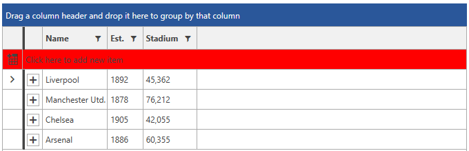

# Styling the GridViewNewRow

In this article we will show how you can explicitly or implicitly style the GridViewNewRow.

## Targeting the GridViewNewRow Element

In order to style the GridViewNewRow, you should create an appropriate style targeting the __GridViewNewRow__ element.

You have two options:

* To create an empty style and set it up on your own.

* To copy the default style of the control and modify it.

>To learn how to modify the default GridViewNewRow style, please refer to the [Modifying Default Styles]() article.

__Example 1: Styling the GridViewNewRow implicitly__

```XAML
	<Style TargetType="telerik:GridViewNewRow">
        <Setter Property="Background" Value="Red" />
    </Style>
```

__Example 2: Styling the GridViewNewRow explicitly__

```XAML
    <Style x:Key="NewRowStyle" TargetType="telerik:GridViewNewRow">
        <Setter Property="Background" Value="Red" />
    </Style>

    <telerik:RadGridView NewRowPosition="Top"
                         NewRowStyle="{StaticResource NewRowStyle}">
```

>If you're using [Implicit Styles](), you should base your style on the __GridViewNewRowStyle__.

#### __Figure 1: RadGridView with styled GridViewNewRow in the Office 2016 theme__



## See Also

 * [Styling Rows]()

 * [Alternating Rows]()

 * [Styling the Row Details]()

 * [Styling the Group Row]()

 * [Styling the Header Row]()
