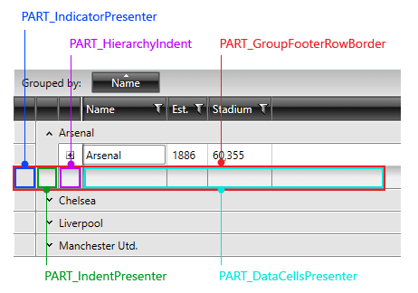
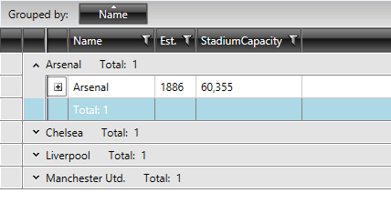
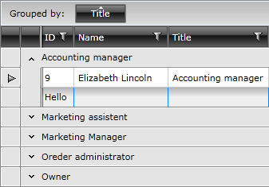

# Styling Group Footers

>tipBefore reading this topic, you might find it useful to get familiar with the [GridViewGroupFooterCell and GridViewGroupFooterRow]().

In this article we will discuss the following topics:

* [Targeting the GridViewGroupFooterRow Element](#targeting-the-gridviewgroupfooterrow-element)

* [Setting RadGridView's GroupFooterRowStyle](#setting-radgridviews-groupfooterrowstyle)

* [Setting RadGridView's GroupFooterRowStyleSelector](#setting-radgridviews-groupfooterrowstyleselector)

* [Targeting the GridViewGroupFooterCell Element](#targeting-the-gridviewgroupfootercell-element)

* [Setting a Column's GroupFooterCellStyle](#setting-a-columns-groupfootercellstyle)

* [Setting a Column's GroupFooterCellStyleSelector](#setting-a-columns-groupfootercellstyleselector)

## Targeting the GridViewGroupFooterRow Element

If you want to style all group footer rows of your application, you should create an appropriate style targeting the __GridViewGroupFooterRow__ element.

#### __Figure 1: GridViewGroupFooterRow template structure__



You have two options:

* To create an empty style and set it up on your own.

* To copy the default style of the control and modify it.

>To learn how to modify the default GridViewFooterCell style, please refer to the [Modifying Default Styles]() article.

__Example 1: Styling all group footer rows of an application__

	```XAML
	<Style TargetType="telerik:GridViewGroupFooterRow">
	            <Setter Property="Foreground" Value="White"/>
	            <Setter Property="Background" Value="LightBlue"/>
	        </Style>
```

>If you're using [Implicit Styles](), you should base your style on the __GridViewGroupFooterRowStyle__.

## Setting RadGridView's GroupFooterRowStyle

RadGridView's footer rows can also be styled by creating an appropriate __Style__ for the **GridViewGroupFooterRow** element and setting it as RadGridView's __GroupFooterRowStyle__ property. 

__Example 2: Setting RadGridView's GroupFooterRowStyle__

	```XAML
	<telerik:RadGridView GroupFooterRowStyle="{StaticResource GridViewFooterRowStyle}" />
```

#### __Figure 2: RadGridView with styled group footer rows__



## Setting RadGridView's GroupFooterRowStyleSelector

You could also use RadGridView's **GroupFooterRowStyleSelector** property to style group footer rows differently based on a specific condition. More details about how this can be achieved can be found in the [GroupFooterRowStyleSelector article]().

## Targeting the GridViewGroupFooterCell Element

In order to style all __RadGridView__ cells of an application, you should create an appropriate style targeting the __GridViewGroupFooterCell__ element.

__Example 6: Styling all group footer cells of an application__

	```XAML
	<Style TargetType="telerik:GridViewGroupFooterCell">
	            <Setter Property="BorderBrush" Value="Red"/>
	            <Setter Property="Background" Value="Blue"/>
	        </Style>
```

>If you're using [Implicit Styles](), you should base your style on the __GridViewGroupFooterCellStyle__.

## Setting a Column's GroupFooterCellStyle

RadGridView's footer cells can also be styled by creating an appropriate __Style__ for the **GridViewGroupFooterCell** element and setting it as the __GroupFooterCellStyle__ property of the respective __GridViewColumn__. 

__Example 7: Setting a column's GroupFooterCellStyle__

	```XAML
	<telerik:GridViewDataColumn DataMemberBinding="{Binding Name}"
	                                Header="Name"
	                                GroupFooterCellStyle="{StaticResource GridViewFooterCellStyle}" />
```

#### __Figure 2: RadGridView with styled group footer cells__



## Setting a Column's GroupFooterCellStyleSelector

You could also use RadGridView's **GroupFooterCellStyleSelector** property to style group footer rows differently based on a specific condition. More details about how this can be achieved can be found in the [GroupFooterCellStyleSelector article]().

## See Also

 * [Styling Group Row]()

 * [Styling the Column Footers]()

 * [Styling the Column Headers]()

 * [Styling a Cell]()
