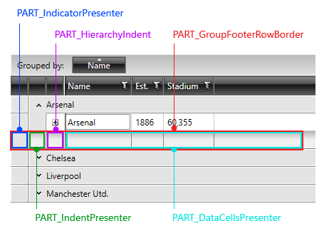
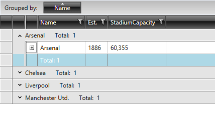
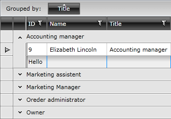

# Styling Group Footers

## Targeting the GridViewGroupFooterRow Element

If you want to style all group footer rows of your application, you should create an appropriate style targeting the __GridViewGroupFooterRow__ element.

#### __Figure 1: GridViewGroupFooterRow template structure__

You have two options:

* To create an empty style and set it up on your own.

* To copy the default style of the control and modify it.

>To learn how to modify the default GridViewFooterCell style, please refer to the [Modifying Default Styles]() article.

__Example 1: Styling all group footer rows of an application__

<snippet id='radgridview-styles-and-templates-styling-group-footers-example_1_styling_all_group_footer_rows_of_an_application-xaml' />

>If you're using [Implicit Styles](), you should base your style on the __GridViewGroupFooterRowStyle__.

## Setting RadGridView GroupFooterRowStyle

RadGridView's footer rows can also be styled by creating an appropriate __Style__ for the **GridViewGroupFooterRow** element and setting it as RadGridView's __GroupFooterRowStyle__ property. 

__Example 2: Setting RadGridView's GroupFooterRowStyle__

<snippet id='radgridview-styles-and-templates-styling-group-footers-example_2_setting_radgridview_s_groupfooterrowstyle-xaml' />

#### __Figure 2: RadGridView with styled group footer rows__

## Setting RadGridView GroupFooterRowStyleSelector

You could also use RadGridView's **GroupFooterRowStyleSelector** property to style group footer rows differently based on a specific condition. More details about how this can be achieved can be found in the [GroupFooterRowStyleSelector article]().

## Targeting the GridViewGroupFooterCell Element

In order to style all __RadGridView__ cells of an application, you should create an appropriate style targeting the __GridViewGroupFooterCell__ element.

__Example 6: Styling all group footer cells of an application__

<snippet id='radgridview-styles-and-templates-styling-group-footers-example_6_styling_all_group_footer_cells_of_an_application-xaml' />

>If you're using [Implicit Styles](), you should base your style on the __GridViewGroupFooterCellStyle__.

## Setting a Column GroupFooterCellStyle

RadGridView's footer cells can also be styled by creating an appropriate __Style__ for the **GridViewGroupFooterCell** element and setting it as the __GroupFooterCellStyle__ property of the respective __GridViewColumn__. 

__Example 7: Setting a column's GroupFooterCellStyle__

<snippet id='radgridview-styles-and-templates-styling-group-footers-example_7_setting_a_column_s_groupfootercellstyle-xaml' />

#### __Figure 2: RadGridView with styled group footer cells__

## Setting a Column's GroupFooterCellStyleSelector

You could also use RadGridView's **GroupFooterCellStyleSelector** property to style group footer rows differently based on a specific condition. More details about how this can be achieved can be found in the [GroupFooterCellStyleSelector article]().

## See Also

 * [Styling Group Row]()

 * [Styling the Column Footers]()

 * [Styling the Column Headers]()

 * [Styling a Cell]()
