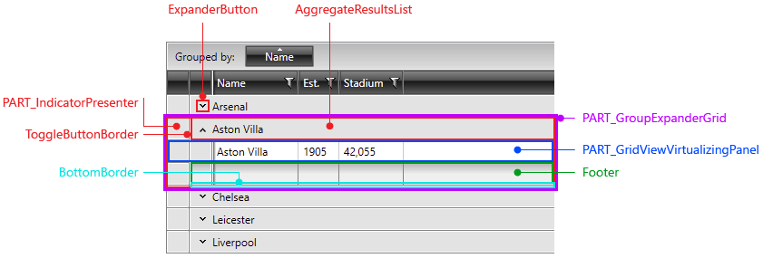
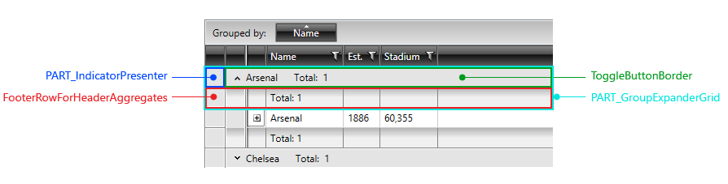
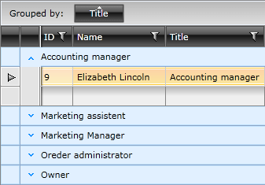

# Styling Group Row

>importantWith R3 2012, Telerik introduced __GroupRenderMode="Flat"__ which uses the **GroupHeaderRow** element as opposed to the **Nested** group render mode that uses the **GridViewGroupRow**. You should target the correct element in order for your styles to be applied. Please look at this [help article]() for details.

## Targeting the GridViewGroupRow Element

In order to style all group rows of __RadGridView__ instances with **GroupRenderMode="Nested"** in your application, you should create an appropriate style targeting the __GridViewGroupRow__ element.

#### __Figure 1: GridViewGroupRow template structure__



You have two options:

* To create an empty style and set it up on your own.

* To copy the default style of the control and modify it.

>To learn how to modify the default GridViewCell style, please refer to the [Modifying Default Styles]() article.

__Example 1: Targetting GridViewGroupRow__

```XAML
	<Style TargetType="{x:Type telerik:GridViewGroupRow}">
	    <Setter Property="MinHeight" Value="60" />
	</Style>
```

>If you're using [Implicit Styles](), you should base your style on the __GridViewGroupRowStyle__.

## Targeting the GroupHeaderRow Element

If you have set your **GroupRenderMode** to **Flat**, your style should target the __GroupHeaderRow__ element.

#### __Figure 2: GroupHeaderRow template structure__



__Example 2: Targetting GroupHeaderRow__

```XAML
	<Style TargetType="{x:Type telerik:GroupHeaderRow}">
	    <Setter Property="MinHeight" Value="60" />
	</Style>
```

>If you're using [Implicit Styles](), you should base your style on the __GroupHeaderRowStyle__.

## Setting RadGridView's GroupRowStyle

The __RadGridView__ exposes the __GroupRowStyle__ property of type __Style__. It is applied to the __GridViewGroupRow__/__GroupHeaderRow__ visual elements inside the __RadGridView__.

__Example 2: Setting RadGridView's GroupRowStyle__

```XAML
	<telerik:RadGridView GroupRowStyle="{StaticResource GroupRowStyle}" />
```

#### __Figure 3: RadGridView with styled group rows__



>In order to fully style the grouping appearance you have to also modify the styles for [GridViewRow](), [GridViewGroupRow]() and [indent cells]().

## Setting RadGridView's GroupRowStyleSelector

You could also use RadGridView's **GroupRowStyleSelector** property to style group rows differently based on a specific condition. The [following article]() demonstrates how this can be done.

## See Also

 * [Styling Group Footers]()

 * [Grouping Modes]()

 * [Basic Grouping]()

 * [Group Aggregates]()

 * [Group Footers]()
