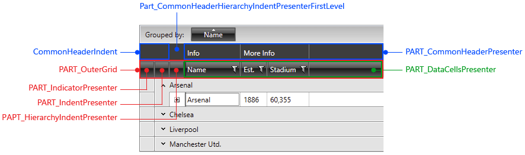
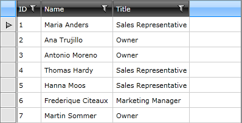

# Styling Header Row

#### __Figure 1: GridViewHeaderRow template structure__



## Targeting the GridViewHeaderRow Element

In order to style all __RadGridView__ header rows of an application, you should create an appropriate style targeting the __GridViewHeaderRow__ element.

You have two options:

* To create an empty style and set it up on your own.

* To copy the default style of the control and modify it.

>To learn how to modify the default GridViewHeaderRow style, please refer to the [Modifying Default Styles]() article.

__Example 1: Styling all header rows of an application__

```XAML
	<Style TargetType="telerik:GridViewHeaderRow">
	    <Setter Property="Background" Value="Red"/>
	</Style>
```

>If you're using [Implicit Styles](), you should base your style on the __GridViewHeaderRowStyle__.

## Setting RadGridView's HeaderRowStyle

__RadGridView's header row__ can also be styled by creating an appropriate __Style__ for the **GridViewHeaderRow**  element and setting it as the __HeaderRowStyle__ property.

__Example 2: Setting RadGridView's HeaderRowStyle__

```XAML
	<telerik:RadGridView HeaderRowStyle="{StaticResource HeaderRowStyle}" />
```

#### __Figure 1: RadGridView with styled header row__



>As you can see, the changes we made apply only for the row. The header cells remain unchanged. To learn how to style them, take a look at the [Styling Column Headers]() topic.

## See Also

* [Styling Column Headers]()
* [Styling a Row]()
* [Styling the Row Details]()
* [Styling the Group Row]()
