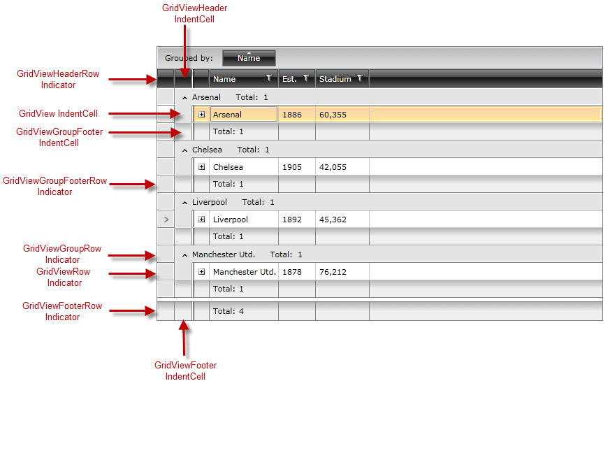
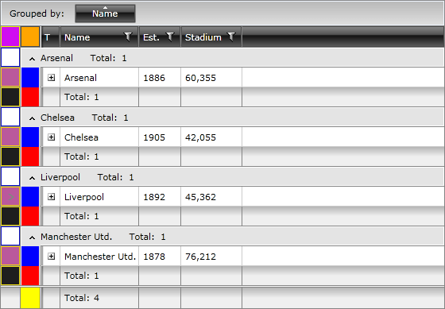

# Styling Indent Cells

__RadGridView__ exposes different [indent cells](#indent-cells) and [indicator presenters](#indicator-presenters) depending on its current state - being grouped, in a hierarchy, or displaying the corresponding footers. __Figure 1__ outlines the visual structure of those elements for a grouped RadGridView with the __ShowColumnFooters__ and __ShowGroupFooters__ properties set to True.

#### __Figure 1: RadGridView Indent Cells and Indicator Presenters__



## Indent Cells

RadGridView exposes four different indent cell types:

* **GridViewIndentCell**: It is part of the **GridViewRow**.

* **GridViewHeaderIndentCell**: It is part of the **GridViewHeaderRow**.

* **GridViewFooterIndentCell**: It is part of the **GridViewFooterRow**.

* **GridViewGroupFooterIndentCell**: It is part of the **GridViewGroupFooterRow**.

Similarly to other __RadGridView__ elements, you may alter their appearance by [modifying their default styles]() or by directly [editing their control templates](). __Example 1__ demonstrates how to create styles that target those elements.

__Example 1: Styling Indent Cells__

```XAML

	<Application.Resources>
        <Style TargetType="telerik:GridViewIndentCell">
            <Setter Property="Background" Value="Red" />
        </Style>

        <Style TargetType="telerik:GridViewHeaderIndentCell">
            <Setter Property="Background" Value="Blue" />
        </Style>
        
        <Style TargetType="telerik:GridViewFooterIndentCell">
            <Setter Property="Background" Value="Green" />
        </Style>

        <Style TargetType="telerik:GridViewGroupFooterIndentCell">
            <Setter Property="Background" Value="Yellow" />
        </Style>
    </Application.Resources>
```

#### __Figure 2: A grouped RadGridView with styled indent cells__


## Indicator Presenters

__RadGridView__ exposes five indicator presenters, each of them belonging to the corresponding row:

* **GridViewRow**

* **GridViewHeaderRow**

* **GridViewGroupRow**

* **GridViewGroupFooterRow**

* **GridViewFooterRow**

You may customize each of them by [editing the control template]() of the respective row and modifying the **Border** element named **PART_IndicatorPresenter**.

**Figure 3** shows a __RadGridView__ with styled indent cells and indicator presenters.

#### __Figure 3: RadGridView with styled indent cells and indicator presenters__



## See Also

* [Styling Rows]()

* [Styling Group Row]()

* [Styling Header Row]()