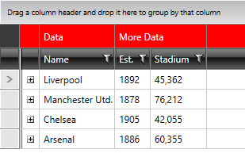

# Styling Column Groups

In order to style **Columng Groups** you will need to create two styles targeting the **CommonHeaderPresenter** and **CommonColumnHeader** elements. The __CommonHeaderPresenter__ hosts all common column headers and the __CommonColumnHeader__ is responsible for a single common column header. 

__Example 1: Styling the CommonHeaderPresenter and CommonColumnHeader__

```XAML
	<UserControl.Resources>
		<!-- If you use NoXaml dlls and the implicit styles theming you will need to set also the BasedOn property to the Style object-->

		<!-- BasedOn="{StaticResource CommonHeaderPresenterStyle}" -->
		<Style TargetType="telerik:CommonHeaderPresenter">
		    <Setter Property="Background" Value="Red"/>
		</Style>

		<!-- BasedOn="{StaticResource CommonColumnHeaderStyle}" -->
		<Style TargetType="telerik:CommonColumnHeader">
		    <Setter Property="Background" Value="Red"/>
		</Style>
	</UserControl.Resources>
```

This will result in a red background for the merged header cells.

#### __Figure 1: The styled Column Groups__



>important As of version Q2 2015, the __GridViewColumnGroupRow__ visual element was introduced. You need to also merge its XAML if using a Custom Theme.

>If you want to have your [**Row Indicator** visible](#hiding-the-row-indicator), you will also need to modify the **CommonHeaderIndent** element of the **GridViewHeaderRow**. You can look at the [Styling Header Row article]() for more information on how to achieve that.

## See Also  
 * [Styles and Templates Overview]() 
 * [Column Groups]().
