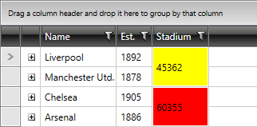

# Styling Merged Cells

>tipMerged cells have a template structure similar to [RadGridView cells](). You could also read the article, [Template Structure of the GridViewMergedCell](#gridviewmergedcell).

In this article we will discuss the following topics:

* [Targeting the GridViewMergedCell element](#targeting-the-gridviewmergedcell-element)

* [Setting MergedCellsStyle](#setting-mergedcellsstyle)

* [Setting MergedCellsStyleSelector](#setting-mergedcellsstyleselector)

## Targeting the GridViewMergedCell element
        
In order to style merged cells, you should create an appropriate style targeting the __GridViewMergedCell__ element.

You have two options:

* To create an empty style and set it up on your own.

* To copy the default style of the control and modify it.

>To learn how to modify the default __GridViewMergedCell__ style, please refer to the [Modifying Default Styles]() article.

>The __GridViewMergedCell__ is located in the __Telerik.Windows.Controls.GridView__ namespace of the __Telerik.Windows.Controls.GridView__ assembly.

>__GridViewMergedCell uses Triggers__, not VisualStateManager's states, to apply property values based on specified conditions.

You can apply a style to the merged cells, similar to:

#### __[XAML] Example 1: Styling all merged cells of an application__

	{{region gridview-styling-merged-cells-1}}
	
	{{endregion}}

>If you're using [Implicit Styles](), you should base your style on the __GridViewMergedCellStyle__.

#### __Figure 1: Styled merged cells__

## Setting MergedCellsStyle

If instead you would like to set a style only for a specific __RadGridView__, you can use its **MergedCellsStyle** property, like so:

#### __[XAML] Example 2: Styling merged cells of a specific RadGridView__

	{{region gridview-styling-merged-cells-2}}
	<Grid.Resources>
		
	</Grid.Resources>

	<telerik:RadGridView MergedCellsStyle="{StaticResource GridViewMergedCellsStyle}" />
	{{endregion}}

>tipIf you are using [Implicit Themes](), you should base the style on the one defined for the corresponding theme.

## Setting MergedCellsStyleSelector

You could also use __RadGridView__'s **MergedCellsStyleSelector** property to style merged cells differently based on a specific condition.

>importantBear in mind that the **MergedCellsStyle** takes precedence over the **MergedCellsStyleSelector** and will overwrite it if both are defined simultaneously.

To do so, first create a new class that inherits the **StyleSelector** class and override its **SelectStyle** method:

#### __[C#] Example 3: The StadiumCapacityStyleSelector class__

	{{region gridview-styling-merged-cells-3}}
	public class StadiumCapacityStyleSelector : StyleSelector
    {
        public override Style SelectStyle(object item, DependencyObject container)
        {
            var cell = item as MergedCellInfo;

            if (cell != null)
            {
                if (int.Parse(cell.Value.ToString()) > 50000)
                {
                    return BigStadiumStyle;
                }
                else
                {
                    return SmallStadiumStyle;
                }
            }

            return null; 
        }
        public Style BigStadiumStyle { get; set; }
        public Style SmallStadiumStyle { get; set; }
    }
	{{endregion}}

#### __[VB.NET] Example 3: The StadiumCapacityStyleSelector class__
	
	{{region gridview-styling-merged-cells-4}}
	Public Class StadiumCapacityStyleSelector
		Inherits StyleSelector
		Public Overrides Function SelectStyle(item As Object, container As DependencyObject) As Style
			Dim cell = TryCast(item, MergedCellInfo)
	
			If cell IsNot Nothing Then
				If Integer.Parse(cell.Value.ToString()) > 50000 Then
					Return BigStadiumStyle
				Else
					Return SmallStadiumStyle
				End If
			End If
	
			Return Nothing
		End Function
		Public Property BigStadiumStyle() As Style
			Get
				Return m_BigStadiumStyle
			End Get
			Set
				m_BigStadiumStyle = Value
			End Set
		End Property
		Private m_BigStadiumStyle As Style
		Public Property SmallStadiumStyle() As Style
			Get
				Return m_SmallStadiumStyle
			End Get
			Set
				m_SmallStadiumStyle = Value
			End Set
		End Property
		Private m_SmallStadiumStyle As Style
	End Class
	{{endregion}}

In the XAML file, define the style selector as a resource and set the properties of the **BigStadiumStyle** and **SmallStadiumStyle**:

#### __[XAML] Example 4: Setting the BigStadiumStyle and SmallStadiumStyle__

	{{region gridview-styling-merged-cells-5}}
	<Grid.Resources>
        <my:StadiumCapacityStyleSelector x:Key="StadiumCapacityStyleSelector">
            <my:StadiumCapacityStyleSelector.BigStadiumStyle>
                
            </my:StadiumCapacityStyleSelector.BigStadiumStyle>
            <my:StadiumCapacityStyleSelector.SmallStadiumStyle>
                
            </my:StadiumCapacityStyleSelector.SmallStadiumStyle>
        </my:StadiumCapacityStyleSelector>
	</Grid.Resources>
	{{endregion}}

>The **"my:"** prefix before **StadiumCapacityStyleSelector** specifies the mapping for the namespace of the project: **xmlns:my="..."**

Finally, set the **MergedCellsStyleSelector** property:

#### __[XAML] Example 5: Setting the MergedCellsStyleSelector property__

	{{region gridview-styling-merged-cells-6}}
	<telerik:RadGridView MergedCellsStyleSelector="{StaticResource StadiumCapacityStyleSelector}" />
	{{endregion}}

And here is the final result:

#### __Figure 2: The merged cells styled using the MergedCellsStyleSelector property__

# See Also

 * [Setting a Theme (Using Implicit Styles)]()

 * [Editing Control Templates]()

 * [Styling a Cell]()
