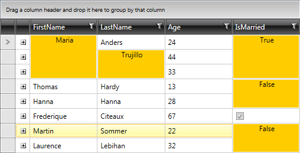

# Styling Merged Cells

>tip Merged cells have a template structure similar to [RadGridView cells](). 

In this article we will discuss the following topics:

* [Targeting the GridViewMergedCell element](#targeting-the-gridviewmergedcell-element)

* [Setting MergedCellsStyle](#setting-mergedcellsstyle)

* [Setting MergedCellsStyleSelector](#setting-mergedcellsstyleselector)

## Targeting the GridViewMergedCell element
        
In order to style merged cells, you should create an appropriate style targeting the __GridViewMergedCell__ element.

You have two options:

* To create an empty style and set it up on your own.

* To copy the default style of the control and modify it.

>To learn how to modify the default __GridViewMergedCell__ style, please refer to the [Modifying Default Styles]() article.

>The __GridViewMergedCell__ is located in the __Telerik.Windows.Controls.GridView__ namespace of the __Telerik.Windows.Controls.GridView__ assembly.

>__GridViewMergedCell uses Triggers__, not VisualStateManager's states, to apply property values based on specified conditions.

You can apply a style to the merged cells, similar to:

__Example 1: Styling all merged cells of an application__

```XAML
	<Style TargetType="telerik:GridViewMergedCell">
		<Setter Property="VerticalContentAlignment" Value="Top"/>
		<Setter Property="HorizontalContentAlignment" Value="Center"/>
		<Setter Property="Background" Value="#ffcc00"/>
	</Style>
```

>If you're using [Implicit Styles](), you should base your style on the __GridViewMergedCellStyle__.

#### __Figure 1: Styled merged cells__



## Setting MergedCellsStyle

If instead you would like to set a style only for a specific __RadGridView__, you can use its **MergedCellsStyle** property, like so:

__Example 2: Styling merged cells of a specific RadGridView__

```XAML
	<Grid.Resources>
		<Style TargetType="telerik:GridViewMergedCell" x:Key="GridViewMergedCellsStyle">
			<Setter Property="VerticalContentAlignment" Value="Top"/>
			<Setter Property="HorizontalContentAlignment" Value="Center"/>
			<Setter Property="Background" Value="#ffcc00"/>
		</Style>
	</Grid.Resources>

	<telerik:RadGridView MergedCellsStyle="{StaticResource GridViewMergedCellsStyle}" />
```

>tip If you are using [Implicit Themes](), you should base the style on the one defined for the corresponding theme.

## Setting MergedCellsStyleSelector

You could also use __RadGridView__'s **MergedCellsStyleSelector** property to style merged cells differently based on a specific condition. More details about how this can be achieved can be found in the [MergedCellsStyleSelector article]().

## See Also

 * [Setting a Theme (Using Implicit Styles)]()

 * [Editing Control Templates]()

 * [Styling a Cell]()
