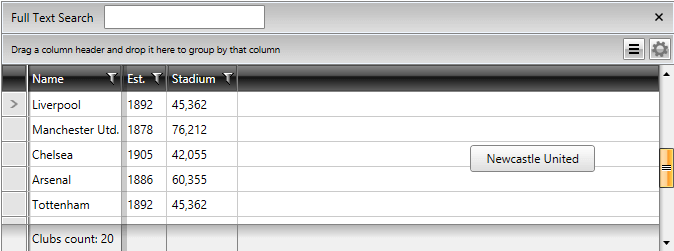
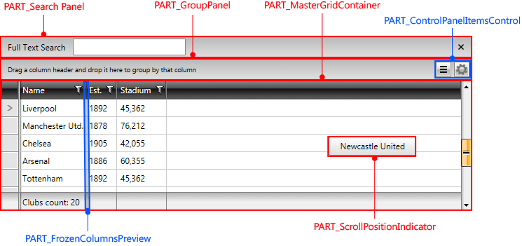
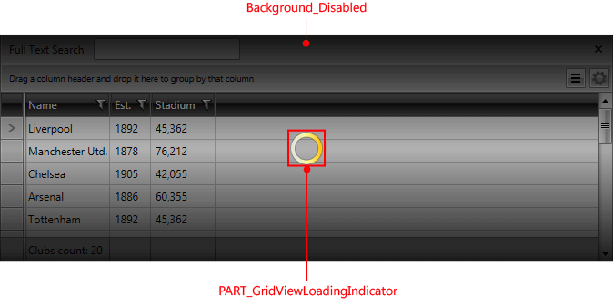

# Styling RadGridView

>tipBefore reading this topic, you might find it useful to get familiar with the [Template Structure of RadGridView](#radgridview).

In this topic we will discuss:

* [Targeting the RadGridView Element](#targeting-the-radgridview-element)

* [Setting RadGridView's Style Property](#setting-radgridviews-style-property)

* [Controlling RadGridView Appearance through Properties](#controlling-radgridview-appearance-through-properties)

#### __Figure 1: The default RadGridView control__



#### __Figure 2: RadGridView template structure__




## Targeting the RadGridView Element

In order to style all instances of __RadGridView__ in your application, you should create an appropriate style targeting the **RadGridView** control.

You have two options:

* To create an empty style and set it up on your own.

* To copy the default style of the control and modify it.

>To learn how to modify the default __RadGridView__ style, please refer to the [Modifying Default Styles]() article.

__Example 1: Styling all instances of RadGridView in an application__

```XAML
	<Style TargetType="telerik:RadGridView">
	    <Setter Property="Foreground" Value="Red"/>
	</Style>
```

>If you're using [Implicit Styles](), you should base your style on the __RadGridViewStyle__.

## Setting RadGridView's Style Property

__RadGridView__ exposes a **Style** property that allows you to apply a style to a specific __RadGridView__ control.

__Example 1: Setting RadGridView Style__

```XAML
	<telerik:RadGridView Style="{StaticResource RadGridViewStyle}" />
```

## Controlling RadGridView Appearance through Properties

__RadGridView__ also exposes a number of properties with which you can easily customize the control without the need of modifying its default style. They can be separated into the following categories:

* [General](#controlling-radgridview-appearance-through-properties-General)

* [Columns](#controlling-radgridview-appearance-through-properties-Columns)

* [Rows](#controlling-radgridview-appearance-through-properties-Rows)

* [Groups](#controlling-radgridview-appearance-through-properties-Groups)

### General

This section covers the following properties:

* __GridLinesVisibility__: Control the way by which the grid lines are visualized. You can choose one of the four possible values defined in the __GridLinesVisibility__ enumeration - __Both__, __Horizontal__, __Vertical__ and __None__. 

* __ShowColumnHeaders__: Shows\hides the column headers. 

* __ShowColumnFooters__: Shows\hides the column footers. 

* __ColumnBackground__: Defines the default background color for all columns. 

* __VerticalGridLinesBrush__: Defines the default color for all vertical grid lines. 

* __HorizontalGridLinesBrush__: Defines the default color for all horizontal grid lines.

Here is a small sample, demonstrating the usage of some of the above properties.

__Example 2: Usage of General properties__

```XAML
	<telerik:RadGridView GridLinesVisibility="Vertical"
	                 ShowColumnFooters="True"
	                 ShowColumnHeaders="False"
	                 ColumnBackground="Bisque"/>
```

The final result should be similar to this:

#### __Figure 3: The result of the modified General properties__


You can see that the columns headers are not visible while the column footers are; moreover, there are only vertical gridlines and the __background__ of all columns is set to Bisque.

### Columns

This section covers the following properties:

* __MinColumnWidth__: Gets or sets the __minimum__ width constraint of a __GridViewColumn__. The minimum width of the object, in pixels. This value can be any value equal to or greater than 0. However, __System.Double.PositiveInfinity__ is __not__ valid. 

* __MaxColumnWidth__: Gets or sets the __maximum__ width constraint of a __GridViewColumn__. The maximum width of the object, in pixels. The default is __System.Double.PositiveInfinity__. This value can be any value equal to or greater than 0. __System.Double.PositiveInfinity__ is __also valid__.  

* __ColumnWidth__: Gets or sets the width of a __GridViewColumn__. 

Here is a small example that demonstrates the usage of some of the above properties.

__Example 3: Usage of Columns properties__

```XAML
	<telerik:RadGridView MinColumnWidth="20" MaxColumnWidth="100" ColumnWidth="80"/>
```

### Rows

This section covers the following properties:

* __RowIndicatorVisibility__: Shows\hides the row indicators, located on the left of each row. 

* __RowDetailsVisibilityMode__: Controls the way by which row details are visualized. You can choose from one of the three possible values defined in the __GridViewRowDetailsVisibilityMode__ enumeration: __Collapsed__, __Visible__ and __VisibleWhenSelected__. 

* __AlternationCount__: Controls the alternate rows count. For example, when set to 2, every second row will have alternating style applied.

* __RowStyle__: Specifies a style for the rows. [Read more]()

* __AlternateRowStyle__: Specifies a style for the alternate rows. [Read more]()

* __RowDetailsStyle__: Specifies a style for the row details. [Read more]()

* __HeaderRowStyle__: Specifies a style for the header row. [Read more]()

Here is a small example that demonstrates the usage of some of the above properties.

__Example 4: Usage of Rows properties__

```XAML
	<telerik:RadGridView RowIndicatorVisibility="Collapsed"
	                 RowDetailsVisibilityMode="VisibleWhenSelected"
	                 AlternationCount="2">
	    <telerik:RadGridView.RowDetailsTemplate>
	        <DataTemplate>
	            <Border BorderThickness="2" Height="35">
	                <TextBlock Text="{Binding Name}" VerticalAlignment="Center" HorizontalAlignment="Center"></TextBlock>
	            </Border>
	        </DataTemplate>
	    </telerik:RadGridView.RowDetailsTemplate>
	</telerik:RadGridView>
```

#### __Figure 4: The result of the modified Rows properties__


You can see that the row indicators are missing and the row details are displayed only for the selected row. Moreover, each even row has different styling because of the __AlternationCount__ property.

### Groups

This section covers the following properties:

* __ShowGroupFooters__: Shows\hides the group footers, located at the bottom of each group. 

* __ShowGroupPanel__: Shows\hides the group panel, located at the top of the __RadGridView__ control. 

* __GroupRowStyle__: Specifies a style for the group row. [Read more]()

* __GroupFooterRowStyle__: Specifies a style for the footer group row. [Read more]()

Here is a small example that demonstrates the usage of some of the above properties.

__Example 5: Usage of Groups properties__

```XAML
	<telerik:RadGridView ShowGroupFooters="True"
	                 ShowGroupPanel="False">
	    <telerik:RadGridView.GroupDescriptors>
	        <telerik:GroupDescriptor Member="Country">
	        </telerik:GroupDescriptor>
	    </telerik:RadGridView.GroupDescriptors>
	</telerik:RadGridView>
```

#### __Figure 5: The result of the modified Groups properties__


You can see that the group footers are shown while the group panel (located at the top of the __RadGridView__) is no longer visible, thus making any changes in the grouping impossible.
