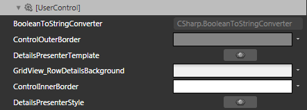
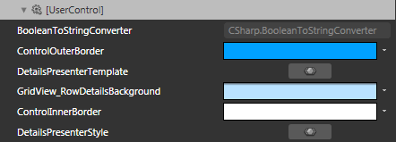

# Styling Row Details

>tipBefore reading this topic, you might find useful to get familiar with the [Template Structure of the GridViewFooterCell control]().

The __RadGridView__ exposes the __RowDetailsStyle__ property of type __Style__. It is applied to the details of the __GridViewRow__ controls inside the __RadGridView__.

You have two options:

* To create an empty style and set it up on your own.

* To copy the default style of the control and modify it.

This topic will show you how to perform the second one.

>tipTo learn more about the __Row Details__ read [here]().

## Modifying the Default Style

To copy the default style, load your project in Expression Blend and open the User Control that holds the __RadGridView__. In the 'Objects and Timeline' pane select the __RadGridView__ you want to style. From the menu choose *Object -> Edit Additional Styles -> __RowDetailsStyle__ -> Edit a Copy*. You will be prompted for the name of the style and where to be placed.

>tipIf you choose to define the style in Application, it would be available for the entire application. This allows you to define a style only once and then reuse it where needed.

After clicking 'OK', Expression Blend will generate the default style of the __DetailsPresenter__ control in the __Resources__ section of your User Control. The properties available for the style will be loaded in the 'Properties' pane and you will be able to modify their default values. You can also edit the generated XAML in the XAML View or in Visual Studio.

If you go to the 'Resources' pane, you will see an editable list of resources generated together with the style and used by it. In this list you will find the brushes, styles and templates needed to change the visual appearance of the __DetailsPresenter__. Their names indicate to which part of the __DetailsPresenter__ appearance they are assigned.



* __ControlOuterBorder__ -  a brush that represents the outer border color of the details container.

* __DetailsPresenterTemplate__ - the __ControlTemplate__, applied to the __DetailsPresenter__ control.

* __GridView_RowDetailBackground__ - a brush that represents the background color of the details presenter container.

* __ControlInnerBorder__ - a brush that represents the inner border color of the details container.

* __DetailsPresenterStyle__ - the __Style__ applied to the __DetailsPresenter__ control.

Here is an example of these resource changed.



And here is a snapshot of the result.



# See Also

 * [Styling the Group Row]()

 * [Styling the Header Row]()

 * [Styling a Row]()
