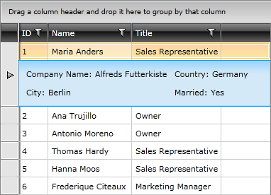

# Styling Row Details

## Targeting the DetailsPresenter Element

In order to style all row details of an application, you should create an appropriate style targeting the __DetailsPresenter__ element.

You have two options:

* To create an empty style and set it up on your own.

* To copy the default style of the control and modify it.

>To learn how to modify the default DetailsPresenter style, please refer to the [Modifying Default Styles]() article.

__Example 1: Styling all row details of an application__

```XAML
	<Style TargetType="telerik:DetailsPresenter">
	    <Setter Property="Background" Value="Red"/>
	    <Setter Property="HorizontalContentAlignment" Value="Right"/>
	</Style>
```

>If you're using [Implicit Styles](), you should base your style on the __DetailsPresenterStyle__.

## Setting a Column's RowDetailsStyle
__RadGridView__ exposes the __RowDetailsStyle__ property of type __Style__. It is applied to the details of the __GridViewRow__ controls inside the __RadGridView__.

__Example 2: Setting RadGridView's RowDetailsStyle__

```XAML
	<telerik:RadGridView RowDetailsStyle="{StaticResource RowDetailsStyle}" />
```

#### __Figure 2: RadGridView with styled row details__



## Setting RadGridView's RowDetailsStyleSelector

You could also use RadGridView's **RowDetailsStyleSelector** property to style rows details differently based on a specific condition. More details about how this can be achieved can be found in the [RowDetailsStyleSelector article]().

## See Also

* [Styling a Row]()
 
* [Styling the Group Row]()

* [Styling the Header Row]()
