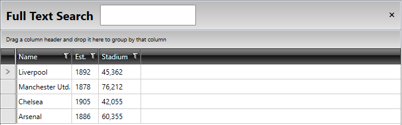
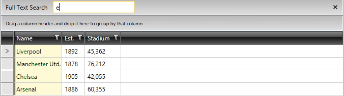
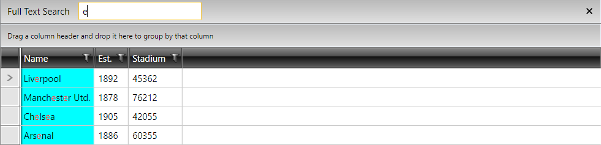

# Styling Search Panel

>Before reading this topic, you might find it useful to get familiar with RadGridView's [Search As You Type]() functionality.

You can style the SearchPanel within the `RadGridView` control by creating an appropriate Style that targets the `GridViewSearchPanel` element.
 
You have two options:

* To create an empty style and set it up on your own.

* To copy the default style of the control and modify it.

>tip If you choose to define the style in the resources of the application, it would be available for the entire application. This allows you to define a style only once and then reuse it where needed.

You can apply a style to the Search Panel, similar to Example 1:

__Applying a style to the search panel of RadGridView__
```XAML
    <!-- If you use NoXaml dlls set the BasedOn property of the Style: BasedOn="{StaticResource GridViewSearchPanelStyle}" -->
	<Style TargetType="telerik:GridViewSearchPanel">
            <Setter Property="FontSize" Value="20"></Setter>
            <Setter Property="FontWeight" Value="Bold"></Setter>
            <Setter Property="Height" Value="50"></Setter>
	</Style>
```

__Appearance of the control after the style is applied__



## Change the Color of the Highlighted Text 

By default, the symbols matching the searching criteria are colored in red. You can easily change the highlighted text value to green by changing the value of the `HightlightBrush` in the `HighlightTextBlock`, as shown in the following example:

__Change the HighlightBrush of the HighlightTextBlock__
```XAML
    <!-- If you use NoXaml dlls set the BasedOn property of the Style: BasedOn="{StaticResource HighlightTextBlockStyle}" -->
	<Style TargetType="telerik:HighlightTextBlock">
			<Setter Property="HighlightBrush" Value="Green"/>		
	</Style> 
```

__Appearance of the highlighted text after the style is applied__



## Change the Background Color of the Highlighted Cell

Through the `HighlightedBackground` property you can modify the background color of the matched `GridViewCell` element when a search as you type is performed. This property is exposed by the GridViewCell class and it is of type `Brush`.

__Set the HighlightedBackground property of the GridViewCell__
```XAML
    <!-- If you use NoXaml dlls set the BasedOn property of the Style: BasedOn="{StaticResource GridViewCellStyle}" -->
	<Style TargetType="telerik:GridViewCell">
	    <Setter Property="HighlightedBackground" Value="Cyan"/>
	</Style>
```

__Appearance of the background color of the highlighted GridViewCell elements__



## See Also
 * [Styling the GridViewEditorPresenter]()
 * [Styling the Column Footers]()
 * [Styling the Column Headers]()
 * [Change Background for Disabled Grid Elements]()
