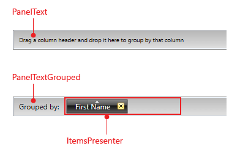
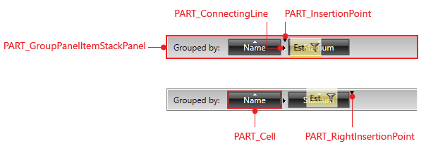
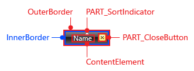
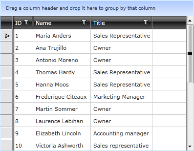

# Styling Group Panel

>tipBefore reading this topic, you might find it useful to get familiar with the [Template Structure of the GridViewGroupPanel and GridViewGroupPanelItem]().

In this article we will discuss the following topics:

* [Targeting the GridViewGroupPanel Element](#targeting-the-gridviewgrouppanel-element)

* [Targeting the GridViewGroupPanelItem Element](#targeting-the-gridviewgrouppanelitem-element)

* [Targeting the GridViewGroupPanelCell Element](#targeting-the-gridviewgrouppanelcell-element)

* [Setting RadGridView's GroupPanelStyle and GroupPanelItemStyle](#setting-radgridviews-grouppanelstyle-and-grouppanelitemstyle)

* [GroupPanelForeground and GroupPanelBackground](#grouppanelforeground-and-grouppanelbackground)

#### __Figure 1: GridViewGroupPanel template structure__



#### __Figure 2: GridViewGroupPanelItem template structure__



#### __Figure 3: GridViewGroupPanelCell template structure__



## Targeting the GridViewGroupPanel Element

In order to style all __RadGridView__ group panels of an application, you should create an appropriate style targeting the __GridViewGroupPanel__ element.

You have two options:

* To create an empty style and set it up on your own.

* To copy the default style of the control and modify it.

>To learn how to modify the default GridViewGroupPanel style, please refer to the [Modifying Default Styles]() article.

__Example 1: Styling all group panels of an application__

```XAML
	<Style TargetType="{x:Type telerik:GridViewGroupPanel}">
	    <Setter Property="MinHeight" Value="50"/>
	    <Setter Property="BorderThickness" Value="3"/>
	</Style>
```

>If you're using [Implicit Styles](), you should base your style on the __GridViewGroupPanelStyle__.

## Targeting the GridViewGroupPanelItem Element

You could also style all group panel items by creating a style, targeting the __GridViewPanelItem__ element, like so:

__Example 2: Styling all group panel items of an application__

```XAML
	<Style TargetType="{x:Type telerik:GridViewGroupPanelItem}">
	    <Setter Property="Padding" Value="10"/>
	    <Setter Property="FontSize" Value="20" />
	</Style>
```

>If you're using [Implicit Styles](), you should base your style on the __GridViewGroupPanelItemStyle__.

## Targeting the GridViewGroupPanelCell Element

The __GridViewGroupPanelItem__ wraps the __GridViewGroupPanelCell__ control, which represents the visual item in the __Group Panel__. If you want to style it, you should create the appropriate style, targeting the __GridViewGroupPanelCell__ element.

__Example 3: Styling the GridViewGroupPanelCell element__

```XAML
	<Style TargetType="{x:Type telerik:GridViewGroupPanelCell}">
	    <Setter Property="Background" Value="Red" />
	    <Setter Property="BorderBrush" Value="Yellow" />
	    <Setter Property="BorderThickness" Value="2" />
	</Style>
```

>If you're using [Implicit Styles](), you should base your style on the __GridViewGroupPanelCellStyle__.

## Setting RadGridView's GroupPanelStyle and GroupPanelItemStyle

__RadGridView__ exposes two properties of type __Style__ - __GroupPanelStyle__ and __GroupPanelItemStyle__. They are applied to the __Group Panel__ and its items.

__Example 4: Setting RadGridView's GroupPanelStyle and GroupPanelItemStyle__

```XAML
	<telerik:RadGridView GroupPanelStyle="{StaticResource GroupPanelStyle}"
	GroupPanelItemStyle="{StaticResource GroupPanelItemStyle}" />
```

#### __Figure 4: RadGridView with styled group panel__



## GroupPanelForeground and GroupPanelBackground

A simple way to change the group panel's foreground and background is through RadGridView's **GroupPanelForeground** and **GroupPanelBackground** properties. **Example 5** shows how this can be done.

__Example 5: Setting RadGridView's GroupPanelForeground and GroupPanelBackground__

```XAML
	<telerik:RadGridView GroupPanelForeground="White"
	GroupPanelBackground="Blue" />
```

## See Also

 * [Styling the Group Row]()

 * [Basic Grouping]()
