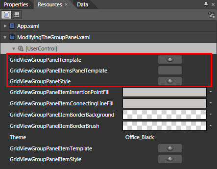
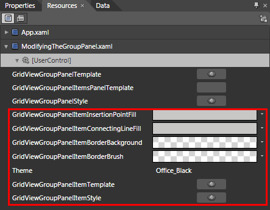

# Styling the Group Panel

>tipBefore reading this topic, you might find useful to get familiar with the [Template Structure of the GridViewGroupPanel control](2CD6EAA0-C735-4FA2-B921-A0D1A4452C10#GridViewGroupPanel) and with the [Template Structure of the GridViewGroupPanelItem](2CD6EAA0-C735-4FA2-B921-A0D1A4452C10#GridViewGroupPanelItem) control.

The __RadGridView__ exposes two properties of type __Style__ - __GroupPanelStyle__ and __GroupPanelItemStyle__. They are applied to the __Group Panel__ and its items.

You have two options:

* To create an empty style and set it up on your own.

* To copy the default style of the control and modify it.

This topic will show you how to perform the second one.

## Modifying the Default Style

To copy the default style, load your project in Expression Blend and open the User Control that holds the __RadGridView__. In the 'Objects and Timeline' pane select the __RadGridView__you want to style. From the menu choose *Object -> Edit Additional Styles -> __GroupPanelStyle__ -> Edit a Copy *or *Object -> Edit Additional Styles -> __GroupPanelItemStyle__ -> Edit a Copy*. You will be prompted for the name of the style and where to be placed.

>tipIf you choose to define the style in Application, it would be available for the entire application. This allows you to define a style only once and then reuse it where needed.

After clicking 'OK', Expression Blend will generate the default value for the selected __Style__ in the __Resources__ section of your User Control. The properties available for the style will be loaded in the 'Properties' pane and you will be able to modify their default values. You can also edit the generated XAML in the XAML View or in Visual Studio.

If you go to the 'Resources' pane, you will see an editable list of resources generated together with the style and used by it. In this list you will find the brushes, styles and templates needed to change the visual appearance of the targeted control__.__Their names indicate to which part of the appearance they are assigned.

Here are the resources generated with the __GroupPanelStyle__:

____

* __GridViewGroupPanelTemplate__ - represents the __ControlTemplate__ for the __Group Panel__.

* __GridViewGroupPanelItemsPanelTemplate__ - represents the __ItemsPanelTemplate__ for the __ItemsPanel__ of the __Group Panel__.

* __GridViewGroupPanelStyle__ - represents the generated __Style__ for the __Group Panel__.

Here are the resources generated with the __GroupPanelItemStyle__:

         
      

* __GridViewGroupPanelItemInsertionPointFill__ - a brush which represents the color of the shape that appears, when dropping a column header at a certain position.

* __GridViewGroupPanelItemConnectingLineFill__ - a brush which represents the color of the line, that connects the items.

* __GridViewGroupPanelItemBorderBackground__ - a brush that represents the background color of the item.

* __GridViewGroupPanelItemBorderBrush__ - a brush that represents the border color of the item.

* __GridViewGroupPanelItemTemplate__ - represents the __ControlTemplate__ for the item.

* __GridViewGroupPanelItemStyle__ - represents the generated __Style__ for the __Group Panel Items__.

>The __GridViewGroupPanelItem__ wraps the __GridViewGroupPanelCell__ control, which represents the visual item in the __Group Panel__. If you want to style it, go to the __GridViewGroupPanelItemTemplate__ and locate it. Copy its default __Style__ via Expression Blend and modify the needed resources.
