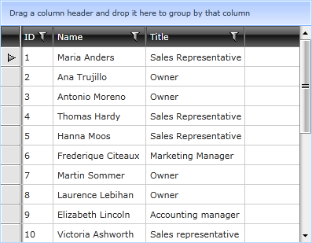

# Styling Group Panel

## Targeting the GridViewGroupPanel Element

In order to style all __RadGridView__ group panels of an application, you should create an appropriate style targeting the __GridViewGroupPanel__ element.

You have two options:

* To create an empty style and set it up on your own.

* To copy the default style of the control and modify it.

>To learn how to modify the default GridViewGroupPanel style, please refer to the [Modifying Default Styles]() article.

__Example 1: Styling all group panels of an application__

<snippet id='radgridview-styles-and-templates-styling-the-group-panel-example_1_styling_all_group_panels_of_an_application-xaml' />

>If you're using [Implicit Styles](), you should base your style on the __GridViewGroupPanelStyle__.

## Targeting the GridViewGroupPanelItem Element

You could also style all group panel items by creating a style, targeting the __GridViewPanelItem__ element, like so:

__Example 2: Styling all group panel items of an application__

<snippet id='radgridview-styles-and-templates-styling-the-group-panel-example_2_styling_all_group_panel_items_of_an_application-xaml' />

>If you're using [Implicit Styles](), you should base your style on the __GridViewGroupPanelItemStyle__.

## Targeting the GridViewGroupPanelCell Element

The __GridViewGroupPanelItem__ wraps the __GridViewGroupPanelCell__ control, which represents the visual item in the __Group Panel__. If you want to style it, you should create the appropriate style, targeting the __GridViewGroupPanelCell__ element.

__Example 3: Styling the GridViewGroupPanelCell element__

<snippet id='radgridview-styles-and-templates-styling-the-group-panel-example_3_styling_the_gridviewgrouppanelcell_element-xaml' />

>If you're using [Implicit Styles](), you should base your style on the __GridViewGroupPanelCellStyle__.

## Setting RadGridView's GroupPanelStyle and GroupPanelItemStyle

__RadGridView__ exposes two properties of type __Style__ - __GroupPanelStyle__ and __GroupPanelItemStyle__. They are applied to the __Group Panel__ and its items.

__Example 4: Setting RadGridView's GroupPanelStyle and GroupPanelItemStyle__

<snippet id='radgridview-styles-and-templates-styling-the-group-panel-example_4_setting_radgridview_s_grouppanelstyle_and_grouppanelitemstyle-xaml' />

#### __Figure 4: RadGridView with styled group panel__

## GroupPanelForeground and GroupPanelBackground

A simple way to change the group panel's foreground and background is through RadGridView's **GroupPanelForeground** and **GroupPanelBackground** properties. **Example 5** shows how this can be done.

__Example 5: Setting RadGridView's GroupPanelForeground and GroupPanelBackground__

<snippet id='radgridview-styles-and-templates-styling-the-group-panel-example_5_setting_radgridview_s_grouppanelforeground_and_grouppanelbackground-xaml' />

## See Also

 * [Styling the Group Row]()

 * [Basic Grouping]()
