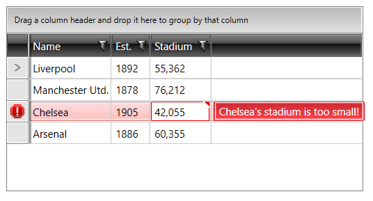

# Styling Invalid Row in RadGridView ##

> Before reading this topic, you might find it useful to get familiar with RadGridView’s [validation]() functionality.

__RadGridView's__ styles are located in __Themes.Implicit\{your theme}\Themes\Telerik.Windows.Controls.GridView.xaml__ file.

To edit the default invalid row style, you can extract the __ControlTemplate__ of the __GridViewRow__. You can check the [Edit the ControlTemplates]() help article which describes how you can get the default template of the controls. In the extracted template, you can navigate to the __Border__ element with x:Name="Background_Invalid" and modify its properties as desired.

>tip In case you use different themes and the user can change them at runtime, you will have to extract and modify the default template of the GridViewRow for each theme that you are using.

#### __Figure 1: The default invalid row__



> To learn how to customize any Telerik theme, see the [Setting a Theme (Using Implicit Styles)]() article.

__Example 1: Invalid row in the Office_Black theme__
```XAML
	 <ControlTemplate x:Key="GridViewRowTemplate" TargetType="grid:GridViewRow">
    . . .
     <Border x:Name="Background_Invalid"
                        Margin="1 1 1 2"
                        BorderThickness="1"
                        CornerRadius="1"
                        BorderBrush="{StaticResource ItemOuterBorder_Invalid}"
                        Grid.Column="2"
                        Grid.ColumnSpan="2"
                        Visibility="Collapsed"
                        grid:SelectiveScrollingGrid.SelectiveScrollingClip="True">
		<Border BorderThickness="1" BorderBrush="{StaticResource ItemInnerBorder_Invalid}" Background="{StaticResource ItemBackground_Invalid}"/>
	</Border>
    . . .
	</ControlTemplate>
```

## See Also
* [Validation]()
