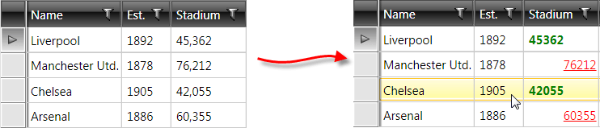

# CellTemplateSelector and CellEditTemplateSelector

This article will show you how to conditionally apply a different data template to RadGridView cells using the __CellTemplateSelector__ and **CellEditTemplateSelector** properties.

>tipTo learn the basics about __TemplateSelectors__ please check [this article]().

Assume we have a GridView bound to a collection of clubs. Each club has a property StadiumCapacity. What we want to achieve is to apply one data template if the capacity is greater than 50 000 and another otherwise:



To do so follow these steps:

**1**. Create a new class which inherits the __DataTemplateSelector__ class.

**2**. Override its __SelectTemplate__ method. Based on your conditions - you return the proper DataTemplate that will be applied to the framework element (cell in our case).


```C#
	public class MyCellTemplateSelector : DataTemplateSelector
	{
	    public override System.Windows.DataTemplate SelectTemplate(object item, System.Windows.DependencyObject container)
	    {
	        if (item is Club)
	        {
	            Club club = item as Club;
	            if (club.StadiumCapacity > 50000)
	            {
	                return bigStadium;
	            }
	            else
	            {
	                return smallStadium;
	            }
	        }
	        return null;
	    }
	    public DataTemplate bigStadium { get; set; }
	    public DataTemplate smallStadium { get; set; }
	}
```


```VB.NET
	Public Class MyCellTemplateSelector
	    Inherits DataTemplateSelector
	    Public Overrides Function SelectTemplate(item As Object, container As System.Windows.DependencyObject) As System.Windows.DataTemplate
	        If TypeOf item Is Club Then
	            Dim club As Club = TryCast(item, Club)
	            If club.StadiumCapacity > 50000 Then
	                Return bigStadium
	            Else
	                Return smallStadium
	            End If
	        End If
	        Return Nothing
	    End Function
	    Public Property bigStadium() As DataTemplate
	        Get
	            Return m_bigStadium
	        End Get
	        Set(value As DataTemplate)
	            m_bigStadium = value
	        End Set
	    End Property
	    Private m_bigStadium As DataTemplate
	    Public Property smallStadium() As DataTemplate
	        Get
	            Return m_smallStadium
	        End Get
	        Set(value As DataTemplate)
	            m_smallStadium = value
	        End Set
	    End Property
	    Private m_smallStadium As DataTemplate
	End Class
```

In this case we have two different DataTemplates that could be applied - bigStadium and smallStadium. Depending on the underlying data we choose / select which template to apply.

**3**. In the XAML file define the template selector as a resource and set the properties of the bigStadium and smallStadium:


```XAML
	<my:MyCellTemplateSelector x:Key="myCellTemplateSelector">
	    <my:MyCellTemplateSelector.bigStadium>
	        <DataTemplate>
	            <TextBlock Text="{Binding StadiumCapacity}" 
	            TextDecorations="underline" 
	            Foreground="Red"
	            TextAlignment="Right" />
	        </DataTemplate>
	    </my:MyCellTemplateSelector.bigStadium>
	    <my:MyCellTemplateSelector.smallStadium>
	        <DataTemplate>
	            <TextBlock Text="{Binding StadiumCapacity}" 
	            FontWeight="Bold" 
	            Foreground="Green"
	            TextAlignment="Left" />
	        </DataTemplate>
	    </my:MyCellTemplateSelector.smallStadium>
	</my:MyCellTemplateSelector>
```

**4**. Finally, set the __CellTemplateSelector__ property of the data column which represents the StadiumCapacity field:


```XAML
	<telerik:GridViewDataColumn DataMemberBinding="{Binding StadiumCapacity}" 
	Header="Stadium" 
	CellTemplateSelector="{StaticResource myCellTemplateSelector}"
	DataFormatString="{}{0:N0}"/>
```

You can use the **CellEditTemplateSelector** property in a similar manner with the only difference that the custom controls you define in the template will be displayed only once it enters edit mode.

>Since the virtualization of the GridView is turned on by default, it is not recommended to work with the visual elements (i.e. GridViewCell) and their properties. __You should not set properties of the GridViewCell inside the SelectTemplate method__. Please check [this help article]() for a reference.
		  
## See Also

* [CellTemplate and CellEditTemplate]()
* [UI Virtualization]()