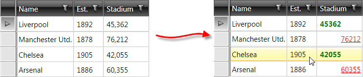

# CellTemplateSelector and CellEditTemplateSelector

This article will show you how to conditionally apply a different data template to RadGridView cells using the __CellTemplateSelector__ and **CellEditTemplateSelector** properties.

>tip To learn the basics about __TemplateSelectors__ please check [this article]().

Assume we have a GridView bound to a collection of clubs. Each club has a property StadiumCapacity. What we want to achieve is to apply one data template if the capacity is greater than 50 000 and another otherwise:

To do so follow these steps:

**1**. Create a new class which inherits the __DataTemplateSelector__ class.

**2**. Override its __SelectTemplate__ method. Based on your conditions - you return the proper DataTemplate that will be applied to the framework element (cell in our case).

<snippet id='radgridview-template-selectors-cell-template-selector-block_1-cs' />

<snippet id='radgridview-template-selectors-cell-template-selector-block_1-vb' />

In this case we have two different DataTemplates that could be applied - bigStadium and smallStadium. Depending on the underlying data we choose / select which template to apply.

**3**. In the XAML file define the template selector as a resource and set the properties of the bigStadium and smallStadium:

<snippet id='radgridview-template-selectors-cell-template-selector-block_2-xaml' />

**4**. Finally, set the __CellTemplateSelector__ property of the data column which represents the StadiumCapacity field:

<snippet id='radgridview-template-selectors-cell-template-selector-block_3-xaml' />

You can use the **CellEditTemplateSelector** property in a similar manner with the only difference that the custom controls you define in the template will be displayed only once it enters edit mode.

>Since the virtualization of the GridView is turned on by default, it is not recommended to work with the visual elements (i.e. GridViewCell) and their properties. __You should not set properties of the GridViewCell inside the SelectTemplate method__. Please check [this help article]() for a reference.
		  
## See Also

* [CellTemplate and CellEditTemplate]()
* [UI Virtualization]()