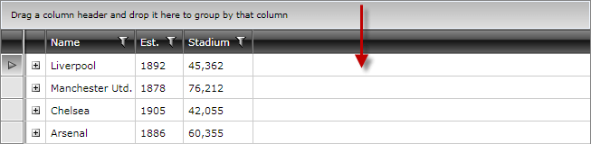
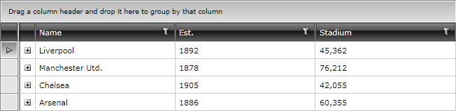

# Additional column added after all gridview columns

__PROBLEM__

RadGridView adds an additional empty column after all gridview columns:



__CAUSE__

RadGridView tries to fill all the width that it takes. Actually this is not a column, but rather the rows which span to end of the __GridView__.

__SOLUTION__

You can use either of the following methods: 

* Set the __ColumnWidth__ property of RadGridView to "__*__"

#### __XAML__

```XAML
	<telerik:RadGridView ItemsSource="{Binding Clubs}" ColumnWidth="*" />
```

The result would be:



* Set the __Width__ of any of the columns to "__*__"

#### __XAML__

```XAML
	<telerik:GridViewDataColumn DataMemberBinding="{Binding StadiumCapacity}" 
	            Header="Stadium" 
	            Width="*"/>
```

Now, the result would be:


## See Also
* [Defining Columns]()