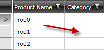

# Empty Cells in Combobox column

__PROBLEM__

When you use the [GridViewComboBoxColumn]() you might encounter empty cells in that column:

__CAUSE__

First you need to check:

* The Output for Binding exceptions

* If the types are of the same type

If you do not encounter any of the above mentioned problems, then you probably use ElementName binding for that column, e.g.

#### __[XAML] Example 1: Binding with ElementName__

{{region xaml-gridview-troubleshooting-blank-cells_0}}
	<telerik:GridViewComboBoxColumn Header="Category"
	DataMemberBinding="{Binding CategoryID}"
	ItemsSource="{Binding Path=DataContext.Categories, ElementName=RootElement}"
	DisplayMemberPath="CategoryName"
	SelectedValueMemberPath="CategoryID" />
{{endregion}}

This will not work, as the DataContext of the cell would not be the ViewModel, but the business object related to the row instead. We do not recommend such approach.

__SOLUTION__

There are two ways of solving the issue : 

## Setting the ItemsSource of GridViewComboBoxColumn

* Expose the ViewModel as a static resource on the page so that it can be easily accessible by the binding:

#### __[XAML] Example 2: Exposing the ViewModel as a Static Resource__

{{region xaml-gridview-troubleshooting-blank-cells_1}}
	<UserControl.Resources>
	    <local:MyViewModel x:Key="MyViewModel" />
	</UserControl.Resources>
{{endregion}}

* Set the ItemsSource of the ComboBox column:

#### __[XAML] Example 3: Setting the ItemsSource of GridViewComboBox declaratively__

{{region xaml-gridview-troubleshooting-blank-cells_2}}
	<telerik:GridViewComboBoxColumn Header="Category"
	DataMemberBinding="{Binding CategoryID}"
	ItemsSource="{Binding Path=Categories, Source={StaticResource MyViewModel}}"
	DisplayMemberPath="CategoryName"
	SelectedValueMemberPath="CategoryID" />
{{endregion}}

#### __[C#] Example 4: Setting the ItemsSource of GridViewComboBoxColumn programmatically__

{{region cs-gridview-troubleshooting-blank-cells_3}}
	private void gridView_DataLoaded(object sender, EventArgs e)
	{
	    (this.radGridView.Columns["Category"] as GridViewComboBoxColumn).ItemsSource = GetCategories();
	}
{{endregion}}

#### __[VB.NET] Example 4: Setting the ItemsSource of GridViewComboBoxColumn programmatically__

{{region vb-gridview-troubleshooting-blank-cells_3}}
	Private Sub gridView_DataLoaded(ByVal sender As Object, ByVal e As EventArgs)
	    TryCast(Me.radGridView.Columns("Category"), GridViewComboBoxColumn).ItemsSource = GetCategories()
	End Sub
{{endregion}}

## Setting the IsLightWeightModeEnabled property

As of __R2 2016__ GridViewComboBoxColumn exposes the IsLightWeightModeEnabled. When set to True, a completely new lookup logic is used which improves the performance of the column and could be a solution for a scenario when having empty cells in it. More information can be found in the [ComboBoxColumn]() topic.

## See also

 * [Binding GridViewComboBoxColumn by using the EnumDataSource utility]()
 
 * [Handle SelectionChanged for ComboBoxColumn]()
  
 * [Filter items in ComboboxColumn]()

 * [Number of clicks in the ComboBoxColumn]()

 * [ComboBoxColumn]()
