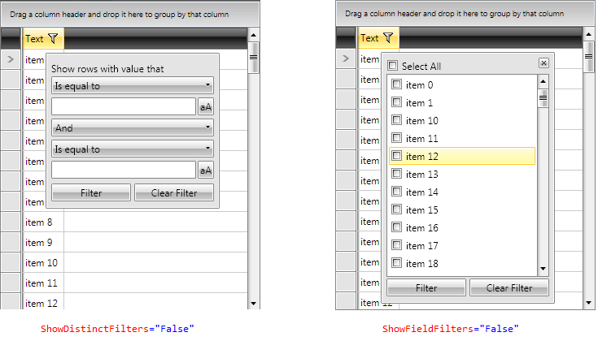
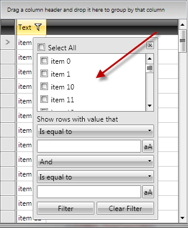

# Filter goes outside the window

__PROBLEM__

The filtering control goes out of the window boundaries when there is not enough space for it. Here is an example:

__SOLUTION__

You have two options here:

1. You can shorten the filtering control by either removing the distinct values listbox (top part) or the field filter controls (bottom part). The two boolean properties that controls these behaviors are: __ShowDistinctFilters__ and __ShowFieldFilters__

2. Or you can customize the ControlTemplate of the FilteringControl to reduce the height of the distinct values ListBox. See how to extract the default ControlTemplate of a Telerik control in the [Editing Control Templates]() article. After the template is copied into your project, find the __PART_DistinctValuesList__ ListBox and set its __MaxHeight__ property to a smaller value, e.g. `MaxHeight="100"`.

