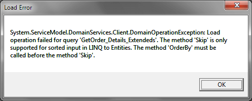

# Paging: Load operation failed for query...

__PROBLEM__

When you use [RadDataPager]() or the [standard DataPager]() you might encounter an error similar to this:

*System.ServiceModel.DomainServices.Client.DomainOperationException: Load operation failed for query 'GetOrder_Details_Extended'. The method 'Skip' is only supported for sorted input in LINQ to Entities. The method 'OrderBy' must be called before the method 'Skip'.*

The Entity Framework can’t work with unsorted collections because the Skip() and Take() extension method expects an __OrderBy__ clause. 

__SOLUTION__

Add an __OrderBy__ clause in your query at server side or define a __SortDescriptor__ in the DomainDataSource in XAML or in the code behind file. 

#### __C#__

{{region cs-gridview-troubleshooting-paging_0}}
	public IQueryable<Order_Details_Extended> GetOrder_Details_Extendeds()
	{
	    return this.ObjectContext.Order_Details_Extendeds.OrderBy(o => o.OrderID);
	}
{{endregion}}

#### __XAML__

{{region xaml-gridview-troubleshooting-paging_1}}
	<riaControls:DomainDataSource AutoLoad="True" 
	                            d:DesignData="{d:DesignInstance my:Order_Details_Extended, CreateList=true}" 
	                            Height="0"
	                            Name="order_Details_ExtendedDomainDataSource" 
	                            QueryName="GetOrder_Details_ExtendedsQuery" Width="0">
	    <riaControls:DomainDataSource.DomainContext>
	        <my:NorthwindDomainContext />
	    </riaControls:DomainDataSource.DomainContext>
	    <riaControls:DomainDataSource.SortDescriptors>
	        <riaControls:SortDescriptor PropertyPath="OrderID" />
	    </riaControls:DomainDataSource.SortDescriptors>
	</riaControls:DomainDataSource>
{{endregion}}

#### __C#__

{{region cs-gridview-troubleshooting-paging_2}}
	order_Details_ExtendedDomainDataSource.SortDescriptors.Add(new SortDescriptor("OrderID", ListSortDirection.Ascending));
{{endregion}}

## See Also

 * [Using Telerik RadDataPager]()
 

 * [Using Silverlight DataPager]()
