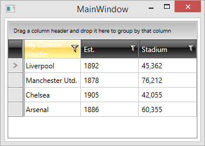
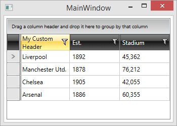

# Foreground Color Does not Change in a Custom Header

__PROBLEM__

You declare a custom header for a column (__Example 1__):

__Example 1: Initial declaration of a custom header__

<snippet id='radgridview-troubleshooting-styling-custom-header-example_1_initial_declaration_of_a_custom_header-xaml' />

As a result, the __Foreground__ color of the custom header does not change on mouse hover (__Figure 1__ ), sorting, etc.		

__Figure 1:__ The __Foreground__ color of the custom header does not change, when the column is hovered.

__CAUSE__

Your custom header is not automatically bound to the header cell's default __Foreground__ color.
		
__SOLUTION__

You can bind the __Foreground__ property of the custom header (in this example this is a __TextBlock__) to the __Foreground__ property of the control containing the content of the __GridViewHeaderCell__. In this case the container is a __ContentControl__ with __x:Name="ContentPresenter"__, which is located in the default __GridViewHeaderCellTemplate__. 

For this to also work when the [UI virtualization]() mechanism of the control is enabled, however, you need to ensure that the TextBlock has been loaded when the binding is performed. For the purpose, you can create the following attached behavior.

__Example 2: The custom attached behavior__
<snippet id='radgridview-troubleshooting-styling-custom-header-example_2_the_custom_attached_behavior-cs' />

__Example 3: Final declaration of a custom header__
<snippet id='radgridview-troubleshooting-styling-custom-header-example_3_final_declaration_of_a_custom_header-xaml' />

>Please note that the "local" namespace needs to point to the namespace where the HeaderInheritForegroundBehavior is defined.

__Figure 2:__ The __Foreground__ color of the custom header now changes, when the column is hovered.

## See Also
* [UI Virtualization]()