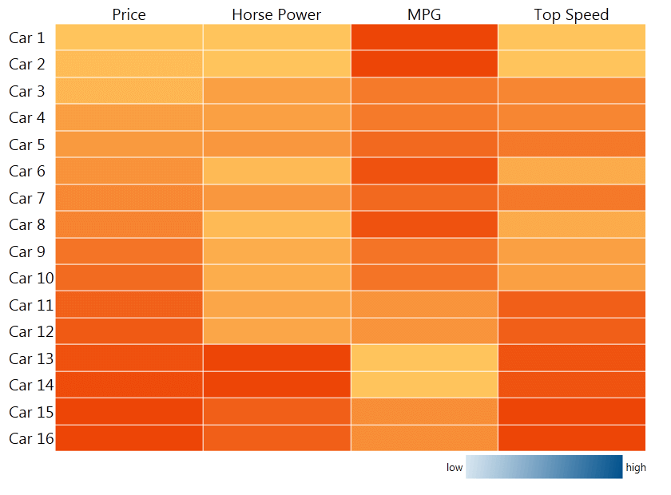
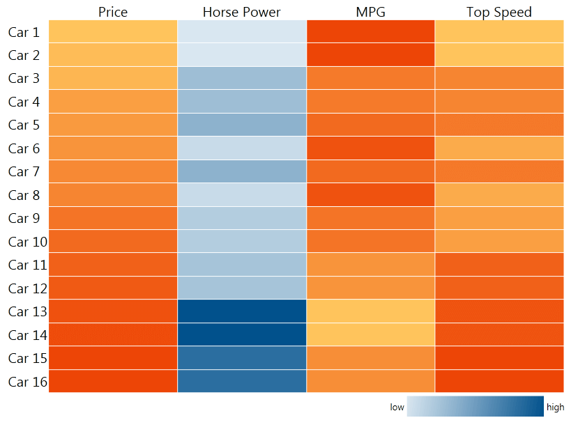
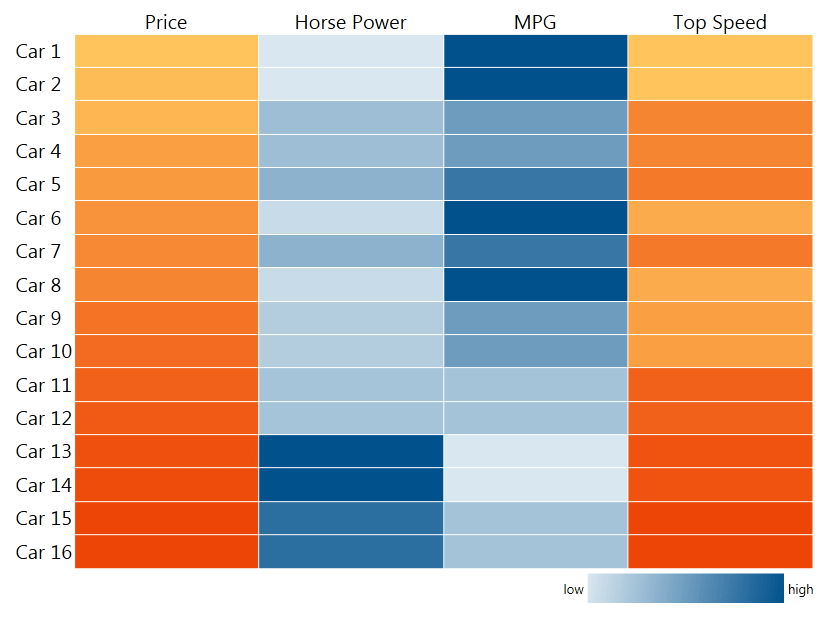
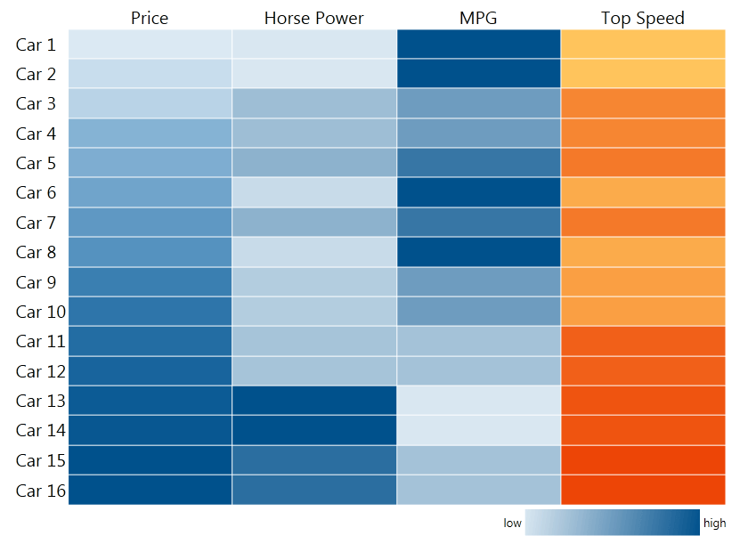
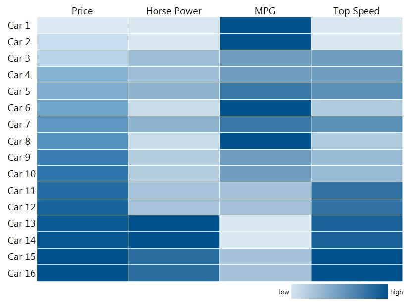
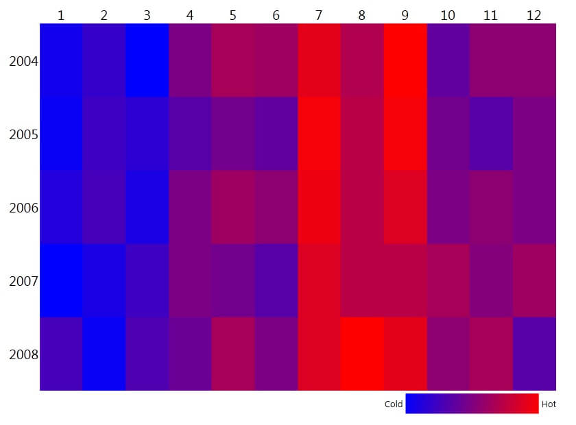

# Colorizers

## Colorizers in a Horizontal/Vertical Definition

In the scenario of Horizontal/Vertical Definition, the colorizer is defined in the MemberMappings of the corresponding definition.

>The only difference between the two definitions is that for the horizontal definition each item gets a row, while the vertical – a column.

Here is our sample RadHeatMap:

<snippet id='radheatmap-colorizers-block_1-cs' />

<snippet id='radheatmap-colorizers-block_1-vb' />

<snippet id='radheatmap-colorizers-block_2-xaml' />

>The legend below the HeatMap is put for later use in this help topic.         

The result can be seen below:

As you may have already noticed, there is no colorizer to be seen in the provided code so far. When there is no colorizer specified, RadHeatMap uses a default one. It is a __HeatMapValueGradientColorizer__.        

__HeatMapValueGradientColorizer__

A colorizer, which contains a set of GradientStops. It chooses a color to be applied according to the values of the items in RadHeatMap and the colorizer’s gradient stops. Depending on the IsAbsolute property value,  each GradientStop.Offset value can be absolute or relative. A colorizer is relative when IsAbsolute is false, which is its default value. In this mode, the colorizer scans all values to find the smallest and greatest ones. In the same manner, these two correspond to GradientStop.Offsets 0 and 1. Also, by setting the RangeMinimum and RangeMaximum properties, you are specifying which are the actual minimum and maximum values , i.e. you are defining some values to correspond to offsets 0 and 1. In absolute mode, the offsets are set to the actual values, which are expected for the items in RadHeatMap        

>When the same instance of any relative colorizer is applied to more than one row or column, the colorizer shares the minimum and maximum between all the assigned rows or columns.          

Now, this is how a HeatMapValueGradientColorizer is defined:

<snippet id='radheatmap-colorizers-heatmapvaluegradientcolorizer-cs' />

<snippet id='radheatmap-colorizers-heatmapvaluegradientcolorizer-vb' />

The same code in XAML will look like this:

<snippet id='radheatmap-colorizers-heatmapvaluegradientcolorizer-xaml' />

>When a value is smaller than the already set RangeMinimum, it gets that color. The same goes for RangeMaximum. This applies for all the types of colorizers.          

Let’s apply a colorizer to the already defined MemberMappings:

<snippet id='radheatmap-colorizers-heatmapvaluegradientcolorizer-xaml' />

Here is the result where the value corresponding to offset 0 is 70 , and to offset 1 – 306:

__HeatMapRangeColorizer__

A colorizer, which uses a set of colors, where each of them corresponds to a range. Similarly to HeatMapValueGradientColorizer, the HeatMapRangeColorizer can work in absolute and relative mode. In absolute mode, the range is specified in actual values, the ones expected for the items to have. In relative mode, the range is always between 0 and 1. The HeatMapRangeColorizer has no property which corresponds to RangeMinimum and RangeMaximum and the colorizer always looks for the smallest and greatest values.

Let’s define an absolute HeatMapRangeColorizer and apply it to Miles per Gallon column.

<snippet id='radheatmap-colorizers-heatmaprangecolorizer-cs' />

<snippet id='radheatmap-colorizers-heatmaprangecolorizer-vb' />

The same code in XAML would look like this:

<snippet id='radheatmap-colorizers-heatmaprangecolorizer-xaml' />

And the result

__HeatMapDesaturationColorizer__

It reduces the level of saturation of a given StartColor depending on the RadHeatMapItem value. The level of desaturation can be controlled using From and To properties. When the From property equals 0 it means that you can get a completely white color for the smallest value. If it is set to a value greater than 0, for example 0.1, the smallest value will have a really faded StartColor but not completely white. On the other hand if To is set to 0.8, you will get a somewhat faded StartColor for the greatest value. Like the other colorizers, the HeatMapDesaturationColorizer has relative and absolute modes which are set again through the IsAbsolute property. In relative, the colorizer looks for the smallest and greatest values from the items, or they can be set through the RangeMinimum and RangeMaximum colors. In absolute mode, these two properties have to be set or, otherwise RadHeatMap will throw an exception.        

This is how HeatMapDesaturationColorizer is defined and applied:

<snippet id='radheatmap-colorizers-heatmapdesaturationcolorizer-cs' />

<snippet id='radheatmap-colorizers-heatmapdesaturationcolorizer-vb' />

<snippet id='radheatmap-colorizers-heatmapdesaturationcolorizer-xaml' />

The result, where there is no complete white, nor green.

The complete code of the example:        

<snippet id='radheatmap-colorizers-heatmapdesaturationcolorizer-cs' />

<snippet id='radheatmap-colorizers-heatmapdesaturationcolorizer-vb' />

<snippet id='radheatmap-colorizers-heatmapdesaturationcolorizer-xaml' />

## Colorizers in Categorical Definition

The only difference between the Categorical and the Horizontal/Vertical definition is that in the Categorical only one colorizer at a time can be applied. Besides this, the colorizers behave in the same way. 
Here is a little demonstration:        

<snippet id='radheatmap-colorizers-heatmapdesaturationcolorizer-cs' />

<snippet id='radheatmap-colorizers-heatmapdesaturationcolorizer-vb' />

<snippet id='radheatmap-colorizers-heatmapdesaturationcolorizer-xaml' />

And the result:

