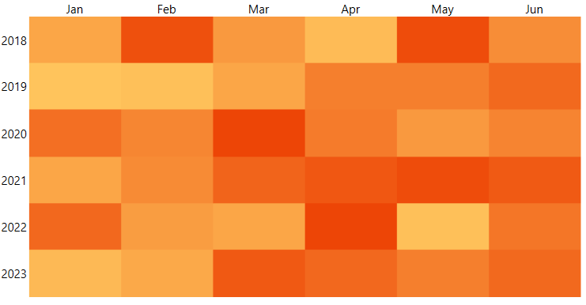

# Getting Started with {{ site.framework_name }} HeatMap

This tutorial will walk you through the creation of a sample application that contains __RadHeatMap__ with a categorical definition.

* [Adding Telerik Assemblies Using NuGet](#adding-telerik-assemblies-using-nuget)
* [Adding Assembly References Manually](#adding-assembly-references-manually)
* [Setting up the Data](#setting-up-the-data)
* [Setting up the Control](#setting-up-the-control)
* [Colorization](#colorization)
			
## Adding Telerik Assemblies Using NuGet

To use __RadHeatMap__ when working with NuGet packages, install the `Telerik.Windows.Controls.DataVisualization.for.Wpf.Xaml` package. The [package name may vary]() slightly based on the Telerik dlls set - [Xaml or NoXaml]()

Read more about NuGet installation in the [Installing UI for WPF from NuGet Package]() article.

>tip With the 2025 Q1 release, the Telerik UI for WPF has a new licensing mechanism. You can learn more about it [here]().

## Adding Assembly References Manually

If you are not using NuGet packages, you can add a reference to the following assemblies:

* __Telerik.Licensing.Runtime__
* __Telerik.Windows.Controls__
* __Telerik.Windows.Controls.DataVisualization__
* __Telerik.Windows.Data__

You can find the required assemblies for each control from the suite in the [Controls Dependencies]()[Controls Dependencies]() help article.

## Setting up the Data

To use the RadHeatMap control you will need to define a model that will describe the data that will be shown.

#### __[C#] Example 1: Defining the model__
{{region radheatmap-getting-started-0}}
	public class TempInfo
	{
		public int Year { get; set; }
		public string Month { get; set; }
		public double Temperature { get; set; }
	}
{{endregion}}

## Setting up the Control

The control works with few different definitions that describe how to data will be shown. In this example we will use the CategoricalDefinition. The definition provides few properties to define what data should be used.

The __RowGroupMemberPath__ property contains the name of the property in the custom model that will be used to generate the rows.

The __ColumnGroupMemberPath__ property contains the name of the property in the custom model that will be used to generate the columns.

The __ValuePath__ property contains the name of the property in the custom model that will be used to generate the cells. Based on that value the cell will be colored differently.

To populate the control with data use its __ItemsSource__ property.

#### __[XAML] Example 2: Defining the heatmap__
{{region radheatmap-getting-started-1}}
	<telerik:RadHeatMap>
		<telerik:RadHeatMap.Definition>
			<telerik:CategoricalDefinition x:Name="categoricalDefinition"
										   RowGroupMemberPath="Year"
										   ColumnGroupMemberPath="Month"
										   ValuePath="Temperature" />
		</telerik:RadHeatMap.Definition>
	</telerik:RadHeatMap>
{{endregion}}

#### __[C#] Example 3: Creating the data and setting the ItemsSource__
{{region radheatmap-getting-started-2}}
	private void PrepareData()
	{
		int year = 2018;
		string[] months = new string[6] { "Jan", "Feb", "Mar", "Apr", "May", "Jun" };
		var randomNumberGenerator = new Random();

		var source = new ObservableCollection<TempInfo>();
		for (int i = 0; i < months.Length; i++)
		{
			for (int k = 0; k < 6; k++)
			{
				var info = new TempInfo() { Year = year + k, Month = months[i], Temperature = randomNumberGenerator.Next(10, 300) };
				source.Add(info);
			}
		}

		this.categoricalDefinition.ItemsSource = source;
	}	
{{endregion}}

#### __Figure 1: RadHeatMap__

## Colorization

The heatmap control has a built-in colorizer that sets the color of each cell based on the plotted value. You can change the colors as you like by defining a new colorizer. You can read more about this in the [Colorizers]() article.


## Telerik UI for WPF Learning Resources

* [Telerik UI for WPF HeatMap Component](https://www.telerik.com/products/wpf/heatmap.aspx)
* [Getting Started with Telerik UI for WPF Components]()
* [Telerik UI for WPF Installation]()
* [Telerik UI for WPF and WinForms Integration]()
* [Telerik UI for WPF Visual Studio Templates]()
* [Setting a Theme with Telerik UI for WPF]()
* [Telerik UI for WPF Virtual Classroom (Training Courses for Registered Users)](https://learn.telerik.com/learn/course/external/view/elearning/16/telerik-ui-for-wpf) 
* [Telerik UI for WPF License Agreement](https://www.telerik.com/purchase/license-agreement/wpf-dlw-s)


## See Also
* [Labels]()
* [Populating With Data]()
