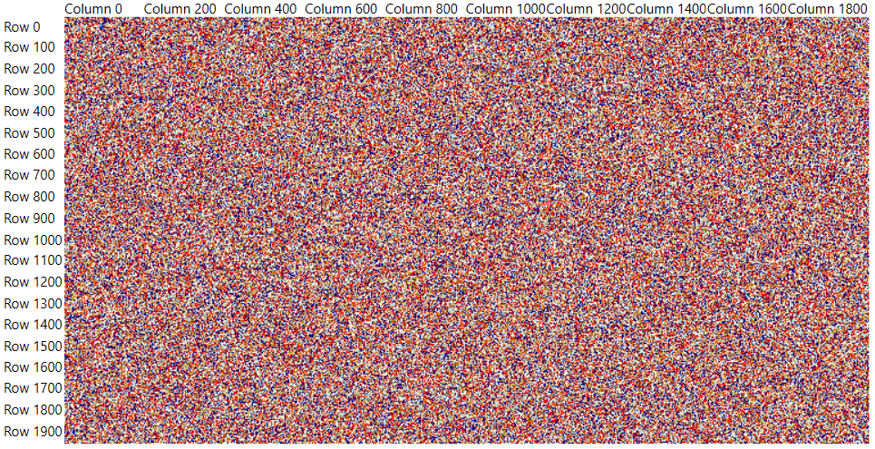

# Create Custom HeatMap Source

This tutorial will walk you through the creation of a custom IHeatMapSource and a HeatMapDefinition that uses it. This allows you to customize the data fetching mechanism of the control, thus optimizing the performance and the memory footprint.

## Creating Custom HeatMap Source

To create a custom source, implement the __IHeatMapSource__ interface.

The interface exposes few methods and properties that are used by the heatmap to get the data from the given collection. For the sake of the simplicity, the example uses a multidimensional array to store data in the heatmap source.

__Example 1: Creating custom data item that will store the information for each cell in the heatmap control__
```C#
	public class CustomHeatMapItem
    {        
		// Stores the color of the cell.
        public Color Color { get; set; }
		// Stores the value of the cell.
        public double Value { get; set; }
    }
```
```VB.NET
	Public Class CustomHeatMapItem
		Public Property Color As Color
		Public Property Value As Double
	End Class
```

__Example 2: Implementing the IHeatMapSource interface__
```C#
	public class CustomHeatMapSource : IHeatMapSource
    {
        private CustomHeatMapItem[,] array;
        public CustomHeatMapSource(CustomHeatMapItem[,] array)
        {
            this.array = array;
        }

        public IEnumerable ItemsSource
        {
            get { return this.array; }
            set { this.array = (CustomHeatMapItem[,])value; }
        }

        public int RowsCount
        {
            get { return this.array.GetLength(0); }
        }

        public int ColumnsCount
        {
            get { return this.array.GetLength(1); }
        }

        public object GetDataItem(int rowIndex, int columnIndex)
        {
            return this.array[rowIndex, columnIndex];
        }

        public double GetValue(int rowIndex, int columnIndex)
        {
            return this.array[rowIndex, columnIndex].Value;
        }

		// Note that this method was implemented only to help us get the color from the array.
		// The method is not required by the interface.
        public Color GetColor(int rowIndex, int columnIndex)
        {
            return this.array[rowIndex, columnIndex].Color;
        }

        public void Dispose()
        {
            this.array = null;
        }
    }
```
```VB.NET
	Public Class CustomHeatMapSource
		Inherits IHeatMapSource

		Private array As CustomHeatMapItem(,)

		Public Sub New(ByVal array As CustomHeatMapItem(,))
			Me.array = array
		End Sub

		Public Property ItemsSource As IEnumerable
			Get
				Return Me.array
			End Get
			Set(ByVal value As IEnumerable)
				Me.array = CType(value, CustomHeatMapItem(,))
			End Set
		End Property

		Public ReadOnly Property RowsCount As Integer
			Get
				Return Me.array.GetLength(0)
			End Get
		End Property

		Public ReadOnly Property ColumnsCount As Integer
			Get
				Return Me.array.GetLength(1)
			End Get
		End Property

		Public Function GetDataItem(ByVal rowIndex As Integer, ByVal columnIndex As Integer) As Object
			Return Me.array(rowIndex, columnIndex)
		End Function

		Public Function GetValue(ByVal rowIndex As Integer, ByVal columnIndex As Integer) As Double
			Return Me.array(rowIndex, columnIndex).Value
		End Function

		Public Function GetColor(ByVal rowIndex As Integer, ByVal columnIndex As Integer) As Color
			Return Me.array(rowIndex, columnIndex).Color
		End Function

		Public Sub Dispose()
			Me.array = Nothing
		End Sub
	End Class
```

## Creating Custom HeatMapDefinition

To use the custom source, implement a custom definition that derives from the __HeatMapDefinition__ class. The class exposes several protected methods and a property that should be overridden.

__Example 3: Implementing the custom HeatMapDefinition__
```C#
	public class CustomHeatMapDefinition : HeatMapDefinition
	{
		private CustomHeatMapSource source;
		public CustomHeatMapDefinition(CustomHeatMapSource source)
		{
			this.source = source;
		}     

		protected override IHeatMapSource Source
		{
			get { return this.source; }
		}
		
		protected override int GetColor(int rowIndex, int columnIndex)
		{
			int color = ToColorInt(this.source.GetColor(rowIndex, columnIndex));
			return color;
		}

		protected override object GetColumnHeader(int index)
		{
			return "Column " + index;
		}

		protected override object GetRowHeader(int index)
		{
			return "Row " + index;
		}

		protected override void OnItemsSourceChanged()
		{            
		}

		private static int ToColorInt(Color color)
		{
			var scaleApha = color.A / 255d;
			return (color.A << 24) | ((byte)(color.R * scaleApha) << 16) | ((byte)(color.G * scaleApha) << 8) | (byte)(color.B * scaleApha);
		}
	}
```
```VB.NET
	Public Class CustomHeatMapDefinition
		Inherits HeatMapDefinition

		Private source As CustomHeatMapSource

		Public Sub New(ByVal source As CustomHeatMapSource)
			Me.source = source
		End Sub

		Protected Overrides ReadOnly Property Source As IHeatMapSource
			Get
				Return Me.source
			End Get
		End Property

		Protected Overrides Function GetColor(ByVal rowIndex As Integer, ByVal columnIndex As Integer) As Integer
			Dim color As Integer = ToColorInt(Me.source.GetColor(rowIndex, columnIndex))
			Return color
		End Function

		Protected Overrides Function GetColumnHeader(ByVal index As Integer) As Object
			Return "Column " & index
		End Function

		Protected Overrides Function GetRowHeader(ByVal index As Integer) As Object
			Return "Row " & index
		End Function

		Protected Overrides Sub OnItemsSourceChanged()
		End Sub
		
		Private Shared Function ToColorInt(ByVal color As Color) As Integer
			Dim scaleApha
			Return ((color.A + 24)  _
						Or ((CType((color.R * scaleApha),Byte) + 16)  _
						Or ((CType((color.G * scaleApha),Byte) + 8)  _
						Or CType((color.B * scaleApha),Byte))))
		End Function
	End Class
```

## Using the Custom Definition

To use the custom definition you can create a multidimensional array of CustomHeatMapItem elements and populate the CustomHeatMapSource with it. Then pass it to the custom definition.

__Example 4: Defining the RadHeatMap in XAML__
```XAML
	<telerik:RadHeatMap x:Name="heatmap">
		<telerik:RadHeatMap.RowHeaderSettings>
			<telerik:HeatMapRowHeaderSettings LabelInterval="100" LabelClipToBounds="False" />
		</telerik:RadHeatMap.RowHeaderSettings>
		<telerik:RadHeatMap.ColumnHeaderSettings>
			<telerik:HeatMapColumnHeaderSettings LabelInterval="200" LabelClipToBounds="False" />
		</telerik:RadHeatMap.ColumnHeaderSettings>            
	</telerik:RadHeatMap>
```

__Example 5: Populating the source with 4 million items and setting the heatmap definition__
```C#

	private static Random randomGenerator = new Random();
	private static List<Color> colors = new List<Color> { Colors.Red, Colors.DarkBlue, Colors.Cornsilk, Colors.DarkGoldenrod, Colors.LightBlue, };

	// You can decide where to use this method. 
	// For example, you can call it after the InitializeComponent() call of the view where the RadHeatMap control is used.
	public void SetDefinition()
	{
		CustomHeatMapItem[,] data = this.GetData(2000, 2000);
		CustomHeatMapSource source = new CustomHeatMapSource(data);
		this.heatmap.Definition = new CustomHeatMapDefinition(source);
	}

	private CustomHeatMapItem[,] GetData(int rowsCount, int columnsCount)
	{
		CustomHeatMapItem[,] data = new CustomHeatMapItem[rowsCount, columnsCount];
		for (int row = 0; row < rowsCount; row++)
		{
			for (int column = 0; column < columnsCount; column++)
			{
				data[row, column] = new CustomHeatMapItem { Value = row + column, Color = colors[randomGenerator.Next(0, colors.Count)] };
			}
		}
		return data;
	}
```
```VB.NET
    Private Shared randomGenerator As Random = New Random()	
    Private Shared colors As List(Of Color) = New List(Of Color) From {
        Colors.Red,
        Colors.DarkBlue,
        Colors.Cornsilk,
        Colors.DarkGoldenrod,
        Colors.LightBlue
    }

    Public Sub SetDefinition()
        Dim data As CustomHeatMapItem(,) = Me.GetData(2000, 2000)
        Dim source As CustomHeatMapSource = New CustomHeatMapSource(data)
        Me.heatmap.Definition = New CustomHeatMapDefinition(source)
    End Sub

    Private Function GetData(ByVal rowsCount As Integer, ByVal columnsCount As Integer) As CustomHeatMapItem(,)
        Dim data As CustomHeatMapItem(,) = New CustomHeatMapItem(rowsCount - 1, columnsCount - 1) {}

        For row As Integer = 0 To rowsCount - 1

            For column As Integer = 0 To columnsCount - 1
                data(row, column) = New CustomHeatMapItem With {
                    .Value = row + column,
                    .Color = colors(randomGenerator.[Next](0, colors.Count))
                }
            Next
        Next
        Return data
    End Function
```

#### __Figure 1: HeatMap with 4 million cells__


> The implementation shown in this example is merely a proof of concept. The main idea of the article is to show you the entry point that you can use in order to create a custom source and use it with the RadHeatMap control.
<!-- -->

>tip You can find a runnable example showing this approach in our [GitHub SDK Examples repository](https://github.com/telerik/xaml-sdk/tree/master/HeatMap/WPF/CustomHeatMapSource).


## See Also
* [Getting Started]()
* [Labels]()
* [Populating With Data]()
