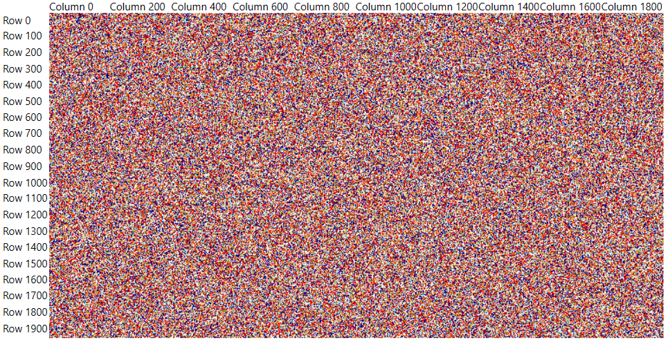

# Create Custom HeatMap Source

This tutorial will walk you through the creation of a custom IHeatMapSource and a HeatMapDefinition that uses it. This allows you to customize the data fetching mechanism of the control, thus optimizing the performance and the memory footprint.

## Creating Custom HeatMap Source

To create a custom source, implement the __IHeatMapSource__ interface.

The interface exposes few methods and properties that are used by the heatmap to get the data from the given collection. For the sake of the simplicity, the example uses a multidimensional array to store data in the heatmap source.

__Example 1: Creating custom data item that will store the information for each cell in the heatmap control__
<snippet id='radheatmap-howto-create-custom-heatmap-source-example_1_creating_custom_data_item_that_will_store_the_information_for_each_cell_in_the_heatmap_control-cs' />

<snippet id='radheatmap-howto-create-custom-heatmap-source-example_1_creating_custom_data_item_that_will_store_the_information_for_each_cell_in_the_heatmap_control-vb' />

__Example 2: Implementing the IHeatMapSource interface__
<snippet id='radheatmap-howto-create-custom-heatmap-source-example_2_implementing_the_iheatmapsource_interface-cs' />

<snippet id='radheatmap-howto-create-custom-heatmap-source-example_2_implementing_the_iheatmapsource_interface-vb' />

## Creating Custom HeatMapDefinition

To use the custom source, implement a custom definition that derives from the __HeatMapDefinition__ class. The class exposes several protected methods and a property that should be overridden.

__Example 3: Implementing the custom HeatMapDefinition__
<snippet id='radheatmap-howto-create-custom-heatmap-source-example_3_implementing_the_custom_heatmapdefinition-cs' />

<snippet id='radheatmap-howto-create-custom-heatmap-source-example_3_implementing_the_custom_heatmapdefinition-vb' />

## Using the Custom Definition

To use the custom definition you can create a multidimensional array of CustomHeatMapItem elements and populate the CustomHeatMapSource with it. Then pass it to the custom definition.

__Example 4: Defining the RadHeatMap in XAML__
<snippet id='radheatmap-howto-create-custom-heatmap-source-example_4_defining_the_radheatmap_in_xaml-xaml' />

__Example 5: Populating the source with 4 million items and setting the heatmap definition__
<snippet id='radheatmap-howto-create-custom-heatmap-source-example_5_populating_the_source_with_4_million_items_and_setting_the_heatmap_definition-cs' />

<snippet id='radheatmap-howto-create-custom-heatmap-source-example_5_populating_the_source_with_4_million_items_and_setting_the_heatmap_definition-vb' />

#### __Figure 1: HeatMap with 4 million cells__

> The implementation shown in this example is merely a proof of concept. The main idea of the article is to show you the entry point that you can use in order to create a custom source and use it with the RadHeatMap control.
<!-- -->

>tip You can find a runnable example showing this approach in our [GitHub SDK Examples repository](https://github.com/telerik/xaml-sdk/tree/master/HeatMap/WPF/CustomHeatMapSource).


## See Also
* [Getting Started]()
* [Labels]()
* [Populating With Data]()
