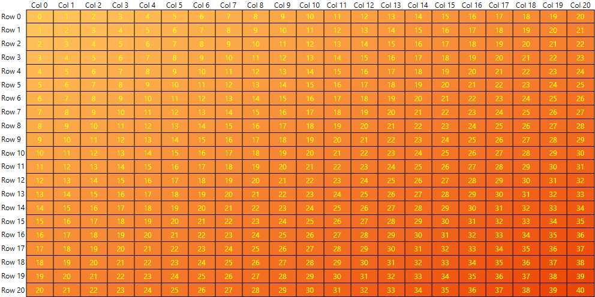

# Labels

Since the __Q2 2015__ release the __RadHeatMap__ control supports cell labels. Users can enable them by using the __RadHeatMap.CellLabelSettings__ property. It is of type *HeatMapCellLabelSettings* which sets or gets the settings that are used to create the labels for each cell. The HeatMapCellLabelSettings class exposes the following properties:

* __FontFamily__: Gets or sets the font family of the control.
* __FontWeight__: – Gets or sets the weight or thickness of the specified font.
* __FontSize__: – Gets or sets the default font size.
* __Foreground__: - Gets or sets a brush that describes the foreground color. 
* __LabelTemplate__: – Gets or sets a DataTemplate that is applied to the labels.

It is important to keep in mind that the default __LabelTemplate__ is set in such a way that the performance of the control is the greatest possible.We use an internal class called LightTextBlock which allows the RadHeatmap to resize its cells faster than when using native TextBlock components.We use Image objects in order to bring better performance when the heatmap control is resized.

## Example

For demonstration purposes we will use a simple class that will represent one cell of the RadHeatMap control. This class will expose three properties:

* __Row__: А string property which gets or sets the row name of the corresponding cell.
* __Column__: А string property which gets or sets the column name of the corresponding cell.
* __Value__: Аn integer property which gets or sets the value of the corresponding cell.

#### __C#__
```C#
	public class PlotInfo
	{
		public string Row { get; set; }

		public string Column { get; set; }

		public double Value { get; set; }
	}
```

To fill the RadHeatMap with sample data we can create a list of *PlotInfo* objects and set it as DataContext of the control. 
	
#### __C#__
```C#
	public partial class MainWindow : Window
    {
        public MainWindow()
        {
            this.InitializeComponent(); 

            var data = new List<PlotInfo>();

            for (int r = 0; r <= 20; r++)
            {
                for (int c = 0; c <= 20; c++)
                {
                    var pi = new PlotInfo
                    {
                        Row = string.Format("Row {0}", r),
                        Column = string.Format("Col {0}", c),
                        Value = r + c
                    };
                    data.Add(pi);
                }
            }
			
            this.heatMap.DataContext = data;
        }
    } 
```

After having the sample data ready we can go in the XAML code and define the RadHeatMap and the CellLabelSettings.

#### __XAML__
```XAML
	<telerik:RadHeatMap x:Name="heatMap"
						CellBorderColor="Black"
						CellBorderThickness="1">
		<telerik:RadHeatMap.Definition>
				<telerik:CategoricalDefinition RowGroupMemberPath="Row"
											   ColumnGroupMemberPath="Column"
											   ValuePath="Value"
											   ItemsSource="{Binding}" />
		 </telerik:RadHeatMap.Definition>
		 <telerik:RadHeatMap.CellLabelSettings>
				<telerik:HeatMapCellLabelSettings Foreground="Yellow" />
		 </telerik:RadHeatMap.CellLabelSettings>		
	 </telerik:RadHeatMap>
```
	 
The final look of the example will be similar to the following picture:
