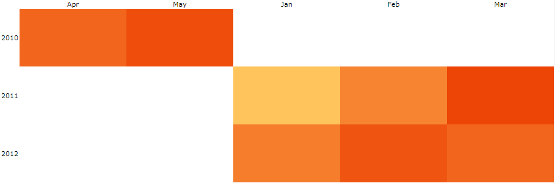
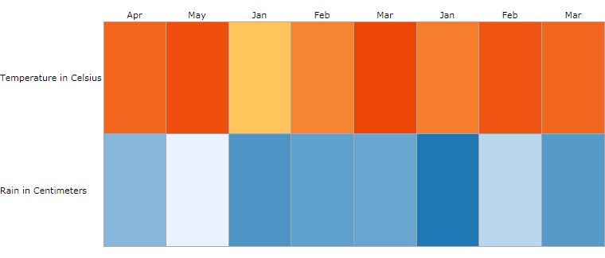

# Populating With Data

This article demonstrates how the RadHeatmap control can be populated with data.

## Setting up the Model and ViewModel

In order to demonstrate how to populate a RadHeatMap with data, we will create a sample object that will hold temperature information and a viewmodel that will hold a collection of those objects.

__Example 1: Setting up the model and viewmodel__
```C#
	public class TempInfo
	{
		public DateTime Year { get; set; }
		public string Month { get; set; }
		public double Temperature { get; set; }
		public double Rain { get; set; }
	}

	public class ViewModel
    {
        private ObservableCollection<TempInfo> tempInfos;

        public ObservableCollection<TempInfo> TempInfos
        {
            get
            {
                if(this.tempInfos == null)
                {
                    this.tempInfos = this.GenerateTempInfos();
                }

                return this.tempInfos;
            }
        }

        private ObservableCollection<TempInfo> GenerateTempInfos()
        {
            DateTime date = DateTime.Today;
            var infos = new ObservableCollection<TempInfo>()
            {
                new TempInfo() { Year = date, Month = "Apr", Temperature = 17, Rain = 8.8},
                new TempInfo() { Year = date, Month = "May", Temperature = 20, Rain = 6.25},

                new TempInfo() { Year = date.AddYears(1), Month = "Jan", Temperature = 5, Rain=10.3},
                new TempInfo() { Year = date.AddYears(1), Month = "Feb", Temperature = 13, Rain = 9.8},
                new TempInfo() { Year = date.AddYears(1), Month = "Mar", Temperature = 21, Rain = 9.6},

                new TempInfo() { Year = date.AddYears(2), Month = "Jan", Temperature = 14, Rain = 11.5},
                new TempInfo() { Year = date.AddYears(2), Month = "Feb", Temperature = 19, Rain = 7.5},
                new TempInfo() { Year = date.AddYears(2), Month = "Mar", Temperature = 17, Rain = 10.1},
            };

            return infos;
        }
    }
```
```VB.NET
	Public Class TempInfo
		Public Property Year() As Date
		Public Property Month() As String
		Public Property Temperature() As Double
		Public Property Rain() As Double
	End Class

	Public Class ViewModel
		Private _tempInfos As ObservableCollection(Of TempInfo)

		Public ReadOnly Property TempInfos() As ObservableCollection(Of TempInfo)
			Get
				If Me._tempInfos Is Nothing Then
					Me._tempInfos = Me.GenerateTempInfos()
				End If

				Return Me._tempInfos
			End Get
		End Property

		Private Function GenerateTempInfos() As ObservableCollection(Of TempInfo)
			Dim [date] As Date = Date.Today
			Dim infos = New ObservableCollection(Of TempInfo)() From {
				New TempInfo() With {
					.Year = [date],
					.Month = "Apr",
					.Temperature = 17,
					.Rain = 8.8
				},
				New TempInfo() With {
					.Year = [date],
					.Month = "May",
					.Temperature = 20,
					.Rain = 6.25
				},
				New TempInfo() With {
					.Year = [date].AddYears(1),
					.Month = "Jan",
					.Temperature = 5,
					.Rain=10.3
				},
				New TempInfo() With {
					.Year = [date].AddYears(1),
					.Month = "Feb",
					.Temperature = 13,
					.Rain = 9.8
				},
				New TempInfo() With {
					.Year = [date].AddYears(1),
					.Month = "Mar",
					.Temperature = 21,
					.Rain = 9.6
				},
				New TempInfo() With {
					.Year = [date].AddYears(2),
					.Month = "Jan",
					.Temperature = 14,
					.Rain = 11.5
				},
				New TempInfo() With {
					.Year = [date].AddYears(2),
					.Month = "Feb",
					.Temperature = 19,
					.Rain = 7.5
				},
				New TempInfo() With {
					.Year = [date].AddYears(2),
					.Month = "Mar",
					.Temperature = 17,
					.Rain = 10.1
				}
			}

			Return infos
		End Function
	End Class
```

## Categorical definition

In order to visualize our data we need to set the __Definition__ property of the control. __Example 2__ demonstrates how to set it to a __CategoricalDefinition__.

__Example 2: Setting the Definition to a CategoricalDefinition__
```XAML
	<Grid>
        <Grid.DataContext>
            <local:ViewModel />
        </Grid.DataContext>

		<telerik:RadHeatMap ShowToolTips="True"
							Height="300">
			<telerik:RadHeatMap.Definition>
				<telerik:CategoricalDefinition ItemsSource="{Binding TempInfos}"
											   RowGroupMemberPath="Year"
											   ColumnGroupMemberPath="Month"
											   ValuePath="Temperature" />
			</telerik:RadHeatMap.Definition>
			<telerik:RadHeatMap.RowHeaderSettings>
				<telerik:HeatMapRowHeaderSettings LabelFormat="yyyy"/>
			</telerik:RadHeatMap.RowHeaderSettings>
		</telerik:RadHeatMap>
	</Grid>
```

#### __Figure 1: RadHeatMap with CategoricalDefinition__


## Vertical definition

Alternatively, we can also use a __VerticalDefinition__. We'll set the months as __HeaderPath__ of our HeatMap. Thus the months supplied by the Month property of our underlying source will be visualized as column headers. For each row we'll display the Temperature and Rain values of the corresponding month.	

__Example 3: Setting the Definition to a VerticalDefinition__
```XAML
	<Grid>
        <Grid.DataContext>
            <local:ViewModel />
        </Grid.DataContext>
        <Grid.Resources>
            <telerik:HeatMapValueGradientColorizer x:Key="myColorizer">
                <GradientStop Offset="0" Color="#D9E7F1" />
                <GradientStop Offset="1" Color="#01518C" />
            </telerik:HeatMapValueGradientColorizer>
        </Grid.Resources>
       
		<telerik:RadHeatMap ShowToolTips="True"
							Height="300"
							CellBorderColor="DarkGray"
							CellBorderThickness="1">
			<telerik:RadHeatMap.Definition>
                <telerik:VerticalDefinition ItemsSource="{Binding TempInfos}"
											HeaderPath="Month">
					<telerik:VerticalDefinition.MemberMappings>
						<telerik:MemberMapping Header="Temperature in Celsius"
											   ValuePath="Temperature"/>
						<telerik:MemberMapping Header="Rain in Centimeters"
											   ValuePath="Rain"
											   Colorizer="{StaticResource myColorizer}"/>
					</telerik:VerticalDefinition.MemberMappings>
				</telerik:VerticalDefinition>
			</telerik:RadHeatMap.Definition>
		</telerik:RadHeatMap>
	</Grid>		
```

>tip You can use the same code to declare a HorizontalDefinition.

#### __Figure 2: RadHeatMap with VerticalDefinition__


>tip Find a runnable project of the previous example in the [WPF Samples GitHub repository](https://github.com/telerik/xaml-sdk/tree/master/HeatMap/WPF/PopulatingWithData).

## See Also

* [Getting Started]()
* [Colorizers]()