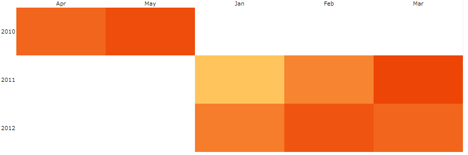
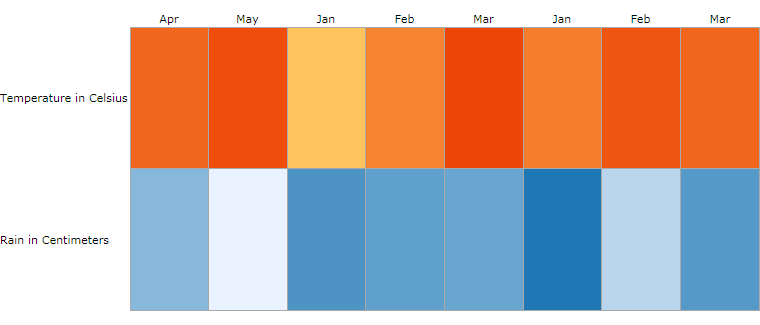

# Populating With Data

This article demonstrates how the RadHeatmap control can be populated with data.

## Setting up the Model and ViewModel

In order to demonstrate how to populate a RadHeatMap with data, we will create a sample object that will hold temperature information and a viewmodel that will hold a collection of those objects.

__Example 1: Setting up the model and viewmodel__
<snippet id='radheatmap-populating-with-data-example_1_setting_up_the_model_and_viewmodel-cs' />

<snippet id='radheatmap-populating-with-data-example_1_setting_up_the_model_and_viewmodel-vb' />

## Categorical definition

In order to visualize our data we need to set the __Definition__ property of the control. __Example 2__ demonstrates how to set it to a __CategoricalDefinition__.

__Example 2: Setting the Definition to a CategoricalDefinition__
<snippet id='radheatmap-populating-with-data-example_2_setting_the_definition_to_a_categoricaldefinition-xaml' />

#### __Figure 1: RadHeatMap with CategoricalDefinition__

## Vertical definition

Alternatively, we can also use a __VerticalDefinition__. We'll set the months as __HeaderPath__ of our HeatMap. Thus the months supplied by the Month property of our underlying source will be visualized as column headers. For each row we'll display the Temperature and Rain values of the corresponding month.	

__Example 3: Setting the Definition to a VerticalDefinition__
<snippet id='radheatmap-populating-with-data-example_3_setting_the_definition_to_a_verticaldefinition-xaml' />

>tip You can use the same code to declare a HorizontalDefinition.

#### __Figure 2: RadHeatMap with VerticalDefinition__

>tip Find a runnable project of the previous example in the [WPF Samples GitHub repository](https://github.com/telerik/xaml-sdk/tree/master/HeatMap/WPF/PopulatingWithData).

## See Also

* [Getting Started]()
* [Colorizers]()