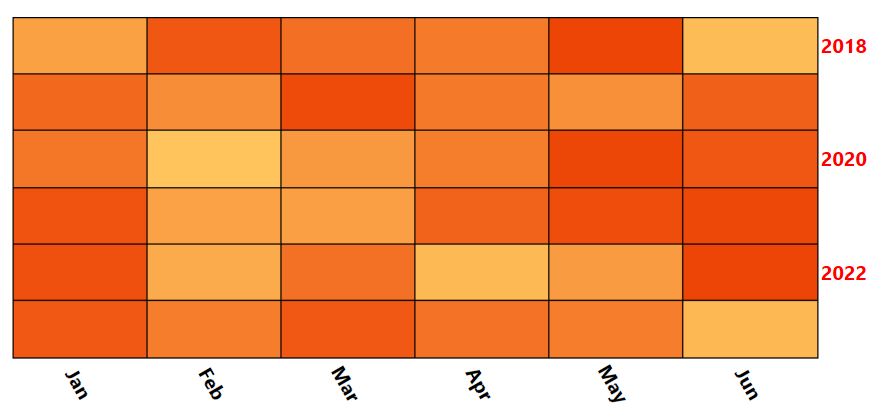

#  Row/Column Headers

The Row/Column headers of the RadHeatMap can be further customized through  the __RowHeaderSettings__ and __ColumnHeaderSettings__ properties. 

## Row Headers

The customization of the row headers is possible through  the __RowHeaderSettings__ property of the RadHeatMap. This property is of type __HeatMapRowHeaderSettings__ object. Except for exposing the common properties for styling the labels, the __HeatMapRowHeaderSettings__ expose an additional one to change the position of the label to the right side of the RadHeatMap. 

 * __LabelsPanelPosition__: A property of type __HeatMapRowLabelsPanelPosition__ that gets or sets the row headers position. This is an enumeration and it allows the following values:
	* __Left__: The row labels will be position on the left side of the RadHeatMap. (Default value)
	* __Right__: The row labels will be position on the right side of the RadHeatMap.

__Example 1: Modifying row headers__

```XAML
	<telerik:RadHeatMap >            
		<telerik:RadHeatMap.RowHeaderSettings>
			<telerik:HeatMapRowHeaderSettings LabelsPanelPosition="Right"/>
		</telerik:RadHeatMap.RowHeaderSettings>
	</telerik:RadHeatMap>
```

## Column Headers

The customization of the column headers is possible through the __ColumnHeaderSettings__ property of the RadHeatMap. This property is of type __HeatMapColumnHeaderSettings__ object. Except exposing the common properties (LabelStyle, HoveredLabelStyle, LabelFormat, etc.) for styling the labels, the __HeatMapColumnHeaderSettings__ provide two additional properties to change the position of the column headers and to rotate the labels.

 * __LabelsPanelPosition__: A property of type __HeatMapColumnLabelsPanelPosition__ that gets or sets the column headers position. This is an enumeration and it allows the following values:
	* __Top__: The column headers will be position at the top of the RadHeatMap. (Default value)
	* __Bottom__: The column headers will be position at the bottom of the RadHeatMap.
	
 * __LabelRotationAngle__: A property of type double that gets or sets the rotation angle applied to the label. 

__Example 2: Modifying column headers__

```XAML
	 <telerik:RadHeatMap >            
		<telerik:RadHeatMap.ColumnHeaderSettings>
			<telerik:HeatMapColumnHeaderSettings LabelsPanelPosition="Bottom" LabelRotationAngle="60"/>
		</telerik:RadHeatMap.ColumnHeaderSettings>
	</telerik:RadHeatMap>
```


### Example

For demonstration purposes, we will use a simple class that will represent one cell of the RadHeatMap control. This class will expose three properties:

 * __Row:__ А string property which gets or sets the row name of the corresponding cell.
 * __Column:__ А string property which gets or sets the column name of the corresponding cell.
 * __Value:__ Аn integer property which gets or sets the value of the corresponding cell.

__Example 3: Creating the model__
```C#
	public class TempInfo
    {
        public int Year { get; set; }
        public string Month { get; set; }
        public double Temperature { get; set; }
    }
```
```VB.NET
    Public Class TempInfo
		Public Property Year As Integer
		Public Property Month As String
		Public Property Temperature As Double
	End Class
```

To fill the RadHeatMap with sample data we can create a list of *TempInfo* objects and set it as DataContext of the control. 

__Example 4: Populating the RadHeatMap control__
```C#
	public partial class MainWindow : Window
    {
        public MainWindow()
        {
            this.InitializeComponent(); 
			this.PrepareData();
        }
		
		private void PrepareData()
		{
			int year = 2018;
			string[] months = new string[6] { "Jan", "Feb", "Mar", "Apr", "May", "Jun" };
			var randomNumberGenerator = new Random();

			var source = new ObservableCollection<TempInfo>();
			for (int i = 0; i < months.Length; i++)
			{
				for (int k = 0; k < 6; k++)
				{
					var info = new TempInfo() { Year = year + k, Month = months[i], Temperature = randomNumberGenerator.Next(10, 300) };
					source.Add(info);
				}
			}

			this.DataContext = source;
		}
    } 
```
```VB.NET
    Public Partial Class MainWindow
		Inherits Window

		Public Sub New()
			Me.InitializeComponent()
			Me.PrepareData()
		End Sub

		Private Sub PrepareData()
			Dim year As Integer = 2018
			Dim months As String() = New String(5) {"Jan", "Feb", "Mar", "Apr", "May", "Jun"}
			Dim randomNumberGenerator = New Random()
			Dim source = New ObservableCollection(Of TempInfo)()

			For i As Integer = 0 To months.Length - 1

				For k As Integer = 0 To 6 - 1
					Dim info = New TempInfo() With {
						.Year = year + k,
						.Month = months(i),
						.Temperature = randomNumberGenerator.[Next](10, 300)
					}
					source.Add(info)
				Next
			Next

			Me.DataContext = source
		End Sub
	End Class
```

After having the sample data ready, we can go in the XAML code and modify row/column headers.

__Example 4: Customizing the Row/Column Headers__
```XAML
	<telerik:RadHeatMap CellBorderColor="Black" CellBorderThickness="1" >		
		<telerik:RadHeatMap.RowHeaderSettings>
			<telerik:HeatMapRowHeaderSettings LabelsPanelPosition="Right" LabelVerticalAlignment="Center" LabelInterval="2">
				<telerik:HeatMapRowHeaderSettings.LabelStyle>
					<Style TargetType="TextBlock">
						<Setter Property="Foreground" Value="Red"/>
						<Setter Property="FontSize" Value="16"/>
						<Setter Property="FontWeight" Value="Bold"/>
					</Style>
				</telerik:HeatMapRowHeaderSettings.LabelStyle>
			</telerik:HeatMapRowHeaderSettings>
		</telerik:RadHeatMap.RowHeaderSettings>

		<telerik:RadHeatMap.ColumnHeaderSettings>
			<telerik:HeatMapColumnHeaderSettings LabelsPanelPosition="Bottom" LabelRotationAngle="60">
				<telerik:HeatMapColumnHeaderSettings.LabelStyle>
					<Style TargetType="TextBlock">
						<Setter Property="FontSize" Value="16"/>
						<Setter Property="FontWeight" Value="Bold"/>
					</Style>
				</telerik:HeatMapColumnHeaderSettings.LabelStyle>
			</telerik:HeatMapColumnHeaderSettings>
		</telerik:RadHeatMap.ColumnHeaderSettings>
		
		<telerik:RadHeatMap.Definition>
			<telerik:CategoricalDefinition x:Name="categoricalDefinition" 
									RowGroupMemberPath="Year" ItemsSource="{Binding}"
									ColumnGroupMemberPath="Month" 
									ValuePath="Temperature" />
		</telerik:RadHeatMap.Definition>
	</telerik:RadHeatMap>
```

#### __Figure 1: RadHeatMap with customized Row/Column Headers__



## See Also
* [Getting Started]()
* [Labels]()
* [Selection]()
* [Populating With Data]()
