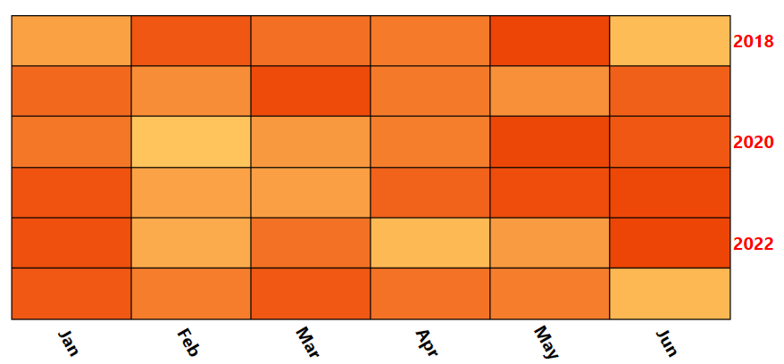

#  Row/Column Headers

The Row/Column headers of the RadHeatMap can be further customized through  the __RowHeaderSettings__ and __ColumnHeaderSettings__ properties. 

## Row Headers

The customization of the row headers is possible through  the __RowHeaderSettings__ property of the RadHeatMap. This property is of type __HeatMapRowHeaderSettings__ object. Except for exposing the common properties for styling the labels, the __HeatMapRowHeaderSettings__ expose an additional one to change the position of the label to the right side of the RadHeatMap. 

 * __LabelsPanelPosition__: A property of type __HeatMapRowLabelsPanelPosition__ that gets or sets the row headers position. This is an enumeration and it allows the following values:
	* __Left__: The row labels will be position on the left side of the RadHeatMap. (Default value)
	* __Right__: The row labels will be position on the right side of the RadHeatMap.

__Example 1: Modifying row headers__

<snippet id='radheatmap-row-column-headers-example_1_modifying_row_headers-xaml' />

## Column Headers

The customization of the column headers is possible through the __ColumnHeaderSettings__ property of the RadHeatMap. This property is of type __HeatMapColumnHeaderSettings__ object. Except exposing the common properties (LabelStyle, HoveredLabelStyle, LabelFormat, etc.) for styling the labels, the __HeatMapColumnHeaderSettings__ provide two additional properties to change the position of the column headers and to rotate the labels.

 * __LabelsPanelPosition__: A property of type __HeatMapColumnLabelsPanelPosition__ that gets or sets the column headers position. This is an enumeration and it allows the following values:
	* __Top__: The column headers will be position at the top of the RadHeatMap. (Default value)
	* __Bottom__: The column headers will be position at the bottom of the RadHeatMap.
	
 * __LabelRotationAngle__: A property of type double that gets or sets the rotation angle applied to the label. 

__Example 2: Modifying column headers__

<snippet id='radheatmap-row-column-headers-example_2_modifying_column_headers-xaml' />

### Example

For demonstration purposes, we will use a simple class that will represent one cell of the RadHeatMap control. This class will expose three properties:

 * __Row:__ А string property which gets or sets the row name of the corresponding cell.
 * __Column:__ А string property which gets or sets the column name of the corresponding cell.
 * __Value:__ Аn integer property which gets or sets the value of the corresponding cell.

__Example 3: Creating the model__
<snippet id='radheatmap-row-column-headers-example_3_creating_the_model-cs' />

<snippet id='radheatmap-row-column-headers-example_3_creating_the_model-vb' />

To fill the RadHeatMap with sample data we can create a list of *TempInfo* objects and set it as DataContext of the control. 

__Example 4: Populating the RadHeatMap control__
<snippet id='radheatmap-row-column-headers-example_4_populating_the_radheatmap_control-cs' />

<snippet id='radheatmap-row-column-headers-example_4_populating_the_radheatmap_control-vb' />

After having the sample data ready, we can go in the XAML code and modify row/column headers.

__Example 4: Customizing the Row/Column Headers__
<snippet id='radheatmap-row-column-headers-example_4_customizing_the_row_column_headers-xaml' />

#### __Figure 1: RadHeatMap with customized Row/Column Headers__

## See Also
* [Getting Started]()
* [Labels]()
* [Selection]()
* [Populating With Data]()
