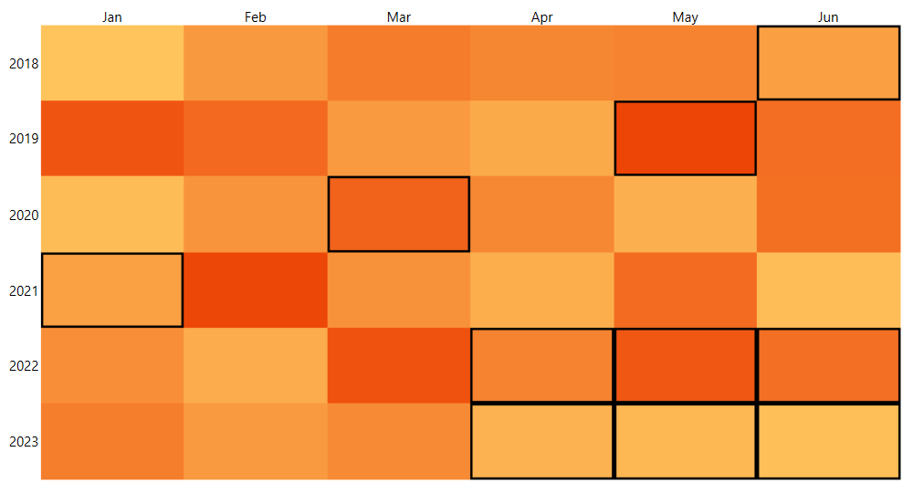

# Selection

The RadHeatMap control allows you to select its cells visually. A border around the cell represents this functionality, and it is disabled by default. To enable it, you need to set the __SelectionMode__, __SelectedCellBorderColor__ and __SelectedCellBorderThickness__ properties of the RadHeatMap.  

>You need to set all three properties (SelectionMode, SelectedCellBorderColor, SelectedCellBorderThickness) otherwise, the visual selection of the cells won't appear.

The __SelectionMode__ property is an enumeration of type __HeatMapSelectionMode__ which provides the following values:

* __None__: The selection is disabled. (default)
* __SingleDataItem__: Only a single data item can be selected with interaction.
* __MultipleDataItems__: Multiple data items can be selected with interaction.

The __SelectedCellBorderColor__ property is of type __Color__ that gets or sets the color of the selection border.

The __SelectedCellBorderThickness__ property is of type __Thickness__ that gets or sets the thickness of the selection border.

__Example 1: Enabling the selection behavior of the RadHeatMap__

```XAML
	 <telerik:RadHeatMap SelectionMode="MultipleDataItems" SelectedCellBorderColor="Red" SelectedCellBorderThickness="2" />
```

#### __Figure 1: RadHeatMap with selection enabled__



## See Also
* [Getting Started]()
* [Labels]()
* [Populating With Data]()
