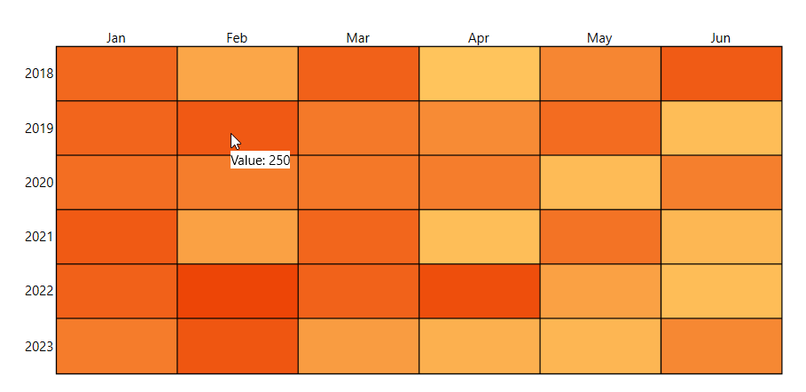

# ToolTip

The RadHeatMap control provides a tooltip behavior which can be used to visualize arbitrary information related to a data point. The ToolTip functionality is disable by default. To enable it, you need to set __ShowToolTips__ property of the RadHeatMap to true. 

__Example 1: Enabling the ToolTip behavior of the RadHeatMap__

```XAML
	 <telerik:RadHeatMap ShowToolTips="True" />
```

## Customizing the Tooltip

To customize the apperance of the tooltip you can use the __HeatMapToolTipSettings__ propertyo of __RadHeatMap__. For demonstration purposes we will use a simple class that will represent one cell of the RadHeatMap control. This class will expose three properties:

 * __Row:__ А string property which gets or sets the row name of the corresponding cell.
 * __Column:__ А string property which gets or sets the column name of the corresponding cell.
 * __Value:__ Аn integer property which gets or sets the value of the corresponding cell.

__Example 2: Creating the model__
```C#
	public class TempInfo
    {
        public int Year { get; set; }
        public string Month { get; set; }
        public double Temperature { get; set; }
    }
```
```VB.NET
    Public Class TempInfo
		Public Property Year As Integer
		Public Property Month As String
		Public Property Temperature As Double
	End Class
```

To fill the RadHeatMap with sample data we can create a list of *TempInfo* objects and set it as DataContext of the control. 

__Example 3: Populating the RadHeatMap control__
```C#
	public partial class MainWindow : Window
    {
        public MainWindow()
        {
            this.InitializeComponent(); 
			this.PrepareData();
        }
		
		private void PrepareData()
		{
			int year = 2018;
			string[] months = new string[6] { "Jan", "Feb", "Mar", "Apr", "May", "Jun" };
			var randomNumberGenerator = new Random();

			var source = new ObservableCollection<TempInfo>();
			for (int i = 0; i < months.Length; i++)
			{
				for (int k = 0; k < 6; k++)
				{
					var info = new TempInfo() { Year = year + k, Month = months[i], Temperature = randomNumberGenerator.Next(10, 300) };
					source.Add(info);
				}
			}

			this.DataContext = source;
		}
    } 
```
```VB.NET
    Public Partial Class MainWindow
		Inherits Window

		Public Sub New()
			Me.InitializeComponent()
			Me.PrepareData()
		End Sub

		Private Sub PrepareData()
			Dim year As Integer = 2018
			Dim months As String() = New String(5) {"Jan", "Feb", "Mar", "Apr", "May", "Jun"}
			Dim randomNumberGenerator = New Random()
			Dim source = New ObservableCollection(Of TempInfo)()

			For i As Integer = 0 To months.Length - 1

				For k As Integer = 0 To 6 - 1
					Dim info = New TempInfo() With {
						.Year = year + k,
						.Month = months(i),
						.Temperature = randomNumberGenerator.[Next](10, 300)
					}
					source.Add(info)
				Next
			Next

			Me.DataContext = source
		End Sub
	End Class
```

After having the sample data ready, we can go in the XAML code and define the RadHeatMap and the __ToolTipSettings__.

__Example 4: Customizing the ToolTip__
```XAML
	<telerik:RadHeatMap ShowToolTips="True" CellBorderColor="Black" CellBorderThickness="1" >
		<telerik:RadHeatMap.ToolTipSettings>
			<telerik:HeatMapToolTipSettings>
				<telerik:HeatMapToolTipSettings.ToolTipTemplate>
					<DataTemplate>
						<StackPanel Orientation="Horizontal" Background="White">
							<TextBlock Text="Value: " FontSize="12"/>
							<TextBlock Text="{Binding Value}" FontSize="12"/>
						</StackPanel>
					</DataTemplate>
				</telerik:HeatMapToolTipSettings.ToolTipTemplate>
			</telerik:HeatMapToolTipSettings>
		</telerik:RadHeatMap.ToolTipSettings>
		<telerik:RadHeatMap.Definition>
			<telerik:CategoricalDefinition x:Name="categoricalDefinition" ItemsSource="{Binding}"
									RowGroupMemberPath="Year" 
									ColumnGroupMemberPath="Month" 
									ValuePath="Temperature" />
		</telerik:RadHeatMap.Definition>
	</telerik:RadHeatMap>
```

#### __Figure 1: RadHeatMap with customized ToolTip__



## See Also
* [Getting Started]()
* [Labels]()
* [Selection]()
* [Populating With Data]()
