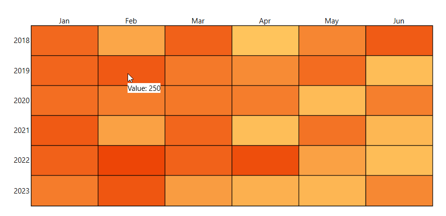

# ToolTip

The RadHeatMap control provides a tooltip behavior which can be used to visualize arbitrary information related to a data point. The ToolTip functionality is disable by default. To enable it, you need to set __ShowToolTips__ property of the RadHeatMap to true. 

__Example 1: Enabling the ToolTip behavior of the RadHeatMap__

<snippet id='radheatmap-tooltip-example_1_enabling_the_tooltip_behavior_of_the_radheatmap-xaml' />

## Customizing the Tooltip

To customize the apperance of the tooltip you can use the __HeatMapToolTipSettings__ propertyo of __RadHeatMap__. For demonstration purposes we will use a simple class that will represent one cell of the RadHeatMap control. This class will expose three properties:

 * __Row:__ А string property which gets or sets the row name of the corresponding cell.
 * __Column:__ А string property which gets or sets the column name of the corresponding cell.
 * __Value:__ Аn integer property which gets or sets the value of the corresponding cell.

__Example 2: Creating the model__
<snippet id='radheatmap-tooltip-example_2_creating_the_model-cs' />

<snippet id='radheatmap-tooltip-example_2_creating_the_model-vb' />

To fill the RadHeatMap with sample data we can create a list of *TempInfo* objects and set it as DataContext of the control. 

__Example 3: Populating the RadHeatMap control__
<snippet id='radheatmap-tooltip-example_3_populating_the_radheatmap_control-cs' />

<snippet id='radheatmap-tooltip-example_3_populating_the_radheatmap_control-vb' />

After having the sample data ready, we can go in the XAML code and define the RadHeatMap and the __ToolTipSettings__.

__Example 4: Customizing the ToolTip__
<snippet id='radheatmap-tooltip-example_4_customizing_the_tooltip-xaml' />

#### __Figure 1: RadHeatMap with customized ToolTip__

## See Also
* [Getting Started]()
* [Labels]()
* [Selection]()
* [Populating With Data]()
