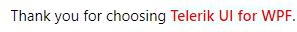
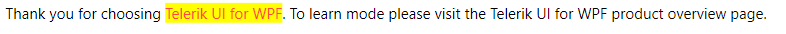

# Custom HighlightTextBlock

The `RadHighlightTextBlock` control allows you to customize the highlighted text, as well as add/remove the matches. To do so, inherit from the RadHighlightTextBlock class and override the `HighlightTextRange` and `GetHighlightInfos` methods.

## Styling the Matches

To style the matches, override the `HighlightTextRange` method. It provides a parameter of the type `HighlightTextInfo`. It stores information about the portion of the RadHighlightTextBlock text that needs to be highlighted. To style it, call the `ApplyPropertyValue` method on the `TextRange` property of the HighlightTextRange's parameter. This method accepts a `DependencyProperty` as a first parameter and as a second-value that will be applied to it.

__Inheriting from the RadHighlightTextBlock class and styling the matches__
```C#
    public class CustomHighlightTextBlock : RadHighlightTextBlock
    {
        protected override void HighlightTextRange(HighlightTextInfo info)
        {
            base.HighlightTextRange(info);

            info.TextRange.ApplyPropertyValue(TextElement.FontWeightProperty, FontWeights.SemiBold);
            info.TextRange.ApplyPropertyValue(TextElement.BackgroundProperty, (SolidColorBrush)new BrushConverter().ConvertFrom("#F4FFFF"));
            info.TextRange.ApplyPropertyValue(TextElement.ForegroundProperty, (SolidColorBrush)new BrushConverter().ConvertFrom("#E60000"));
        }
    }
```
```VB.NET
    Public Class CustomHighlightTextBlock
        Inherits RadHighlightTextBlock

        Protected Overrides Sub HighlightTextRange(ByVal info As HighlightTextInfo)
            MyBase.HighlightTextRange(info)
            info.TextRange.ApplyPropertyValue(TextElement.FontWeightProperty, FontWeights.SemiBold)
            info.TextRange.ApplyPropertyValue(TextElement.BackgroundProperty, CType(New BrushConverter().ConvertFrom("#F4FFFF"), SolidColorBrush))
            info.TextRange.ApplyPropertyValue(TextElement.ForegroundProperty, CType(New BrushConverter().ConvertFrom("#E60000"), SolidColorBrush))
        End Sub
    End Class
```

__Using the custom RadHighlightTextBlock custom styled matches__
```XAML
    <local:CustomHighlightTextBlock Text="Thank you for choosing Telerik UI for WPF." HighlightText="Telerik UI for WPF"/>
```

__Custom RadHighlightTextBlock with custom styled matches__



## Adding/Removing the Matches

To add or remove a match, override the `GetHighlightInfos` method. It will return a collection of `HighlightTextInfo` instances that the RadHighlightTextBlock control will use to highlight each match. You can modify the entries before returning the collection.

__Inheriting from the RadHighlightTextBlock class and removing a match__
```C#
    public class CustomHighlightTextBlock : RadHighlightTextBlock
    {
        protected override IEnumerable<HighlightTextInfo> GetHighlightInfos()
        {
            List<HighlightTextInfo> matches = base.GetHighlightInfos().ToList<HighlightTextInfo>();
            matches.RemoveAt(matches.Count - 1);
            return matches;
        }
    }
```
```VB.NET
    Public Class CustomHighlightTextBlock
        Inherits RadHighlightTextBlock

        Protected Overrides Function GetHighlightInfos() As IEnumerable(Of HighlightTextInfo)
            Dim matches As List(Of HighlightTextInfo) = MyBase.GetHighlightInfos().ToList(Of HighlightTextInfo)()
            matches.RemoveAt(matches.Count - 1)
            Return matches
        End Function
    End Class
```

__Using the custom RadHighlightTextBlock where the last item is removed__
```XAML
    <local:CustomHighlightTextBlock HighlightMode="AllMatches"
                                    Text="Thank you for choosing Telerik UI for WPF. To learn mode please visit the Telerik UI for WPF product overview page." 
                                    HighlightText="Telerik UI for WPF"/>
```

__RadHighlightTextBlock where the last match is omitted__

