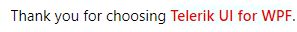
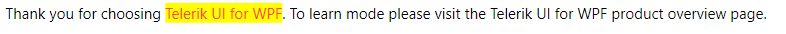

# Custom HighlightTextBlock

The `RadHighlightTextBlock` control allows you to customize the highlighted text, as well as add/remove the matches. To do so, inherit from the RadHighlightTextBlock class and override the `HighlightTextRange` and `GetHighlightInfos` methods.

## Styling the Matches

To style the matches, override the `HighlightTextRange` method. It provides a parameter of the type `HighlightTextInfo`. It stores information about the portion of the RadHighlightTextBlock text that needs to be highlighted. To style it, call the `ApplyPropertyValue` method on the `TextRange` property of the HighlightTextRange's parameter. This method accepts a `DependencyProperty` as a first parameter and as a second-value that will be applied to it.

__Inheriting from the RadHighlightTextBlock class and styling the matches__
<snippet id='radhighlighttextblock-custom-highlighttextblock-inheriting_from_the_radhighlighttextblock_class_and_styling_the_matches-cs' />

<snippet id='radhighlighttextblock-custom-highlighttextblock-inheriting_from_the_radhighlighttextblock_class_and_styling_the_matches-vb' />

__Using the custom RadHighlightTextBlock custom styled matches__
<snippet id='radhighlighttextblock-custom-highlighttextblock-using_the_custom_radhighlighttextblock_custom_styled_matches-xaml' />

__Custom RadHighlightTextBlock with custom styled matches__

## Adding/Removing the Matches

To add or remove a match, override the `GetHighlightInfos` method. It will return a collection of `HighlightTextInfo` instances that the RadHighlightTextBlock control will use to highlight each match. You can modify the entries before returning the collection.

__Inheriting from the RadHighlightTextBlock class and removing a match__
<snippet id='radhighlighttextblock-custom-highlighttextblock-inheriting_from_the_radhighlighttextblock_class_and_removing_a_match-cs' />

<snippet id='radhighlighttextblock-custom-highlighttextblock-inheriting_from_the_radhighlighttextblock_class_and_removing_a_match-vb' />

__Using the custom RadHighlightTextBlock where the last item is removed__
<snippet id='radhighlighttextblock-custom-highlighttextblock-using_the_custom_radhighlighttextblock_where_the_last_item_is_removed-xaml' />

__RadHighlightTextBlock where the last match is omitted__

