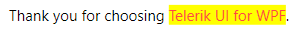
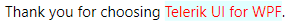
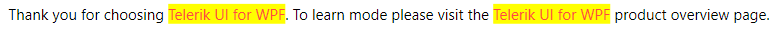

# Getting Started with {{ site.framework_name }} RadHighlightTextBlock

This tutorial will walk you through the creation of a sample application that contains a `RadHighlightTextBlock` control.

## Adding Telerik Assemblies Using NuGet

To use `RadHighlightTextBlock` when working with NuGet packages, install the `Telerik.Windows.Controls.for.Wpf.Xaml` package. The [package name may vary]() slightly based on the Telerik dlls set - [Xaml or NoXaml]()

Read more about NuGet installation in the [Installing UI for WPF from NuGet Package]() article.

>tip With the 2025 Q1 release, the Telerik UI for WPF has a new licensing mechanism. You can learn more about it [here]().

## Adding Assembly References Manually

If you are not using NuGet packages, you can add a reference to the following assemblies:

* __Telerik.Licensing.Runtime__
* __Telerik.Windows.Controls__

## Defining the RadHighlightTextBlock as a Stand-Alone Component

You can add RadHighlightTextBlock manually in XAML as demonstrated in the following example:

#### __[XAML] Adding RadHighlightTextBlock in XAML__
{{region radhighlighttextblock-getting-started-0}}
    <telerik:RadHighlightTextBlock/>
{{endregion}}

## Setting Text and Highlighting Part of It

The RadHighlightTextBlock control displays a text via its `Text` property. It will match and highlight part of the presented text by the value that is set to its `HighlightText` property.

#### __[XAML] Setting text and highlighting part of it__
{{region radhighlighttextblock-getting-started-1}}
    <telerik:RadHighlightTextBlock Text="Thank you for choosing Telerik UI for WPF." HighlightText="Telerik UI for WPF"/>
{{endregion}}

__RadHighlightTextBlock with a highlighted match__

## Changing the Highlight Background and the Highlight Foreground Colors

The RadHighlightTextBlock exposes two properties that will allow you to change the color of the foreground and background of the highlighted matches. To do so, set the `HighlightBackground` and `HighlightForeground` properties.

#### __[XAML] Setting the HighlightBackground and HighlightForeground properties__
{{region radhighlighttextblock-getting-started-2}}
	<telerik:RadHighlightTextBlock Text="Thank you for choosing Telerik UI for WPF." 
	                               HighlightText="Telerik UI for WPF"
	                               HighlightBackground="LightCyan"
	                               HighlightForeground="Red"/>
{{endregion}}

__RadHighlightTextBlock with custom brushes for the HighlightBackground and HighlightForeground properties__

## Highlighting Mode

RadHighlightTextBlock allows you to control how the highlighting will be applied. To the first found match, the last found one, or all occurrences. To control this behavior, set the `HighlightMode` property. The available options are `FirstMatch`, `LastMatch`, and `AllMatches`. The default value is `FirstMatch`.

#### __[XAML] Setting the HighlightMode to AllMatches__
{{region radhighlighttextblock-getting-started-3}}
	<telerik:RadHighlightTextBlock HighlightMode="AllMatches"
                               	   Text="Thank you for choosing Telerik UI for WPF. To learn mode please visit the Telerik UI for WPF product overview page."
                                   HighlightText="Telerik UI for WPF"/>
{{endregion}}

__RadHighlightTextBlock with highlighting all the matches__

## Setting a Theme

The controls from our suite support different themes. You can see how to apply a theme different than the default one in the [Setting a Theme]() help article.

>important Changing the theme using implicit styles will affect all controls that have styles defined in the merged resource dictionaries. This is applicable only for the controls in the scope in which the resources are merged. 

* Choose between the themes and add reference to the corresponding theme assembly (ex: __Telerik.Windows.Themes.Windows8.dll__). You can see the different themes applied in the __Theming__ examples from our [WPF Controls Examples](https://demos.telerik.com/wpf/)[Silverlight Controls Examples](https://demos.telerik.com/silverlight/#PanelBar/Theming) application.

* Merge the ResourceDictionaries with the namespace required for the controls that you are using from the theme assembly. For the RadHighlightTextBlock, you will need to merge the following resources:

	* __Telerik.Windows.Controls__

The following example demonstrates how to merge the ResourceDictionaries so that they are applied globally for the entire application.

#### __[XAML] Merge the ResourceDictionaries__
{{region radhighlighttextblock-getting-started-4}}
    <Application.Resources>
    	<ResourceDictionary>
    		<ResourceDictionary.MergedDictionaries>
    			<ResourceDictionary Source="/Telerik.Windows.Themes.Windows8;component/Themes/System.Windows.xaml"/>
    			<ResourceDictionary Source="/Telerik.Windows.Themes.Windows8;component/Themes/Telerik.Windows.Controls.xaml"/>
    		</ResourceDictionary.MergedDictionaries>
    	</ResourceDictionary>
    </Application.Resources>
{{endregion}}

>Alternatively, you can change the theme of the control via the [StyleManager](https://docs.telerik.com/devtools/wpf/styling-and-appearance/stylemanager/common-styling-apperance-setting-theme-wpf).


## Telerik UI for WPF Learning Resources

* [Telerik UI for WPF HighlightTextBlock Component](https://www.telerik.com/products/wpf/highlighttextblock.aspx)
* [Getting Started with Telerik UI for WPF Components]()
* [Telerik UI for WPF Installation]()
* [Telerik UI for WPF and WinForms Integration]()
* [Telerik UI for WPF Visual Studio Templates]()
* [Setting a Theme with Telerik UI for WPF]()
* [Telerik UI for WPF Virtual Classroom (Training Courses for Registered Users)](https://learn.telerik.com/learn/course/external/view/elearning/16/telerik-ui-for-wpf) 
* [Telerik UI for WPF License Agreement](https://www.telerik.com/purchase/license-agreement/wpf-dlw-s)


## See Also
* [Custom HighlightTextBlock]()