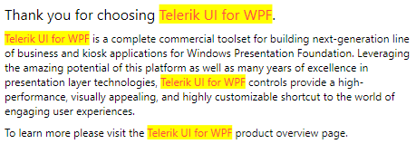

# {{ site.framework_name }} RadHighlightTextBlock Overview

The HighlightTextBlock component allows you to highlight parts or the whole text that it displays. You can use it as a stand-alone control or integrate it with other components.





>tip Get started with the control with its [Getting Started]() help article that shows how to use it in a basic scenario.

## Key Features

* __Highlighting__&mdash;The control provides you with the ability to highlight parts of the text or the entire text that it presents. It also provides the ability to match all instances of the searched text or only its first occurrence.
* __Integration__&mdash;The HighlightTextBlock component allows you to use it with other components.
* __Customization__&mdash;You can add/remove the matches, as well as style them.

> Check out the demos application at [demos.telerik.com](https://demos.telerik.com/wpf/).

## See Also
* [Visual Structure]()
* [Getting Started]()