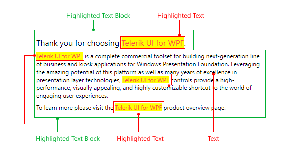

# Visual Structure

This section defines terms and concepts used in the scope of the `RadHighlightTextBlock` control with which you have to get familiar before you continue to read its documentation. They can also be helpful when contacting our support service in order to describe your issue better.

* __Text__&mdash;The text that the RadHighlightTextBlock control presents.
* __Highlighted Text__&mdash;The matched part of the text that the RadHighlightTextBlock control displays.

>tip Get started with the control with its [Getting Started]() help article that shows how to use it in a basic scenario.

## See Also
* [Getting Started]()