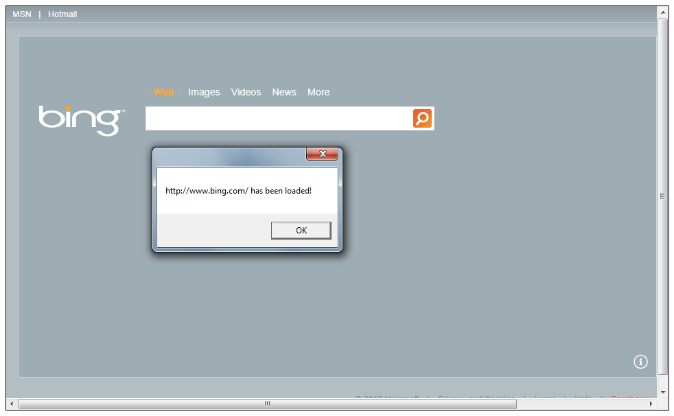

# RadHtmlPlaceholder Events

## 

One of the important custom events that __RadHtmlPlaceholder__ exposes is the __UrlLoaded__ event. This event occurs as soon as the external url that is set as a source is loaded.
				

#### __XAML__

{{region radhtmlplaceholder-howto-events_0}}
	<UserControl x:Class="RadHtmlPlaceholderDemo.Page" 
	             xmlns="http://schemas.microsoft.com/winfx/2006/xaml/presentation"
	             xmlns:x="http://schemas.microsoft.com/winfx/2006/xaml"
	             xmlns:telerik="http://schemas.telerik.com/2008/xaml/presentation"
	             Width="700"
	             Height="400">
	    <Grid x:Name="LayoutRoot" 
	          Margin="10"
	          Background="White">
	        <Border BorderBrush="Black" BorderThickness="1">
	            <telerik:RadHtmlPlaceholder x:Name="RadHtmlPlaceholder1" 
	                                        SourceUrl="http://www.bing.com"
	                                        UrlLoaded="RadHtmlPlaceholder_UrlLoaded" />
	        </Border>
	    </Grid>
	</UserControl>
{{endregion}}

#### __C#__

{{region radhtmlplaceholder-howto-events_1}}
	using System;
	using System.Windows;
	using System.Windows.Controls;
	namespace RadHtmlPlaceholderDemo
	{
		public partial class Page : UserControl
		{
			public Page()
			{
				InitializeComponent();
			}
			private void RadHtmlPlaceholder_UrlLoaded(object sender, EventArgs e)
			{
				string message = string.Format("{0} has been loaded!", RadHtmlPlaceholder1.SourceUrl);
				MessageBox.Show(message);
			}
		}
	}
	{{endregion}}

#### __VB.NET__

{{region radhtmlplaceholder-howto-events_1}}
	Imports System.Windows
	Imports System.Windows.Controls
	Namespace RadHtmlPlaceholderDemo
		Partial Public Class Page
			Inherits UserControl
			Public Sub New()
				InitializeComponent()
			End Sub
			Private Sub RadHtmlPlaceholder_UrlLoaded(ByVal sender As Object, ByVal e As EventArgs)
				Dim message As String = String.Format("{0} has been loaded!", RadHtmlPlaceholder1.SourceUrl)
				MessageBox.Show(message)
			End Sub
		End Class
	End Namespace

## See Also

 * [Integrating RadHtmlPlaceholder and RadWindow]()

 * [RadHtmlPlaceholder Events]()

 * [Display HTML string in RadHtmlPlaceholder]()

 * [Display external page in RadHtmlPlaceholder]()

 * [Getting Started]()
