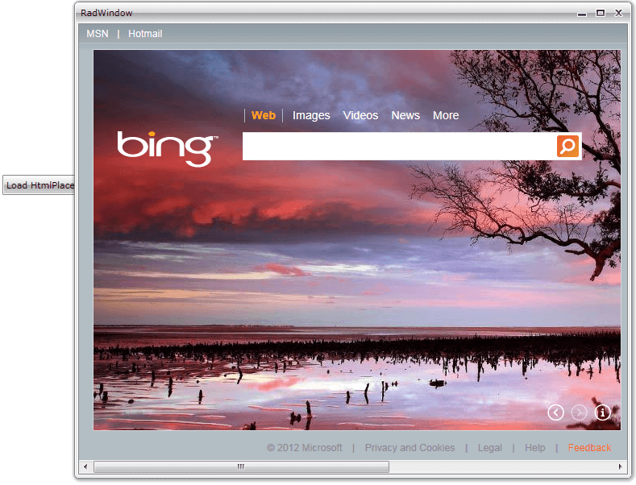

# Integrating RadHtmlPlaceholder and RadWindow

In order to use the __RadWindow__ control in your application, you need to add a reference to the __Telerik.Windows.Controls.Navigation__ assembly. You can find more info [here](http://www.telerik.com/help/wpf/installation-installing-controls-dependencies-wpf.html).You can find more info [here](http://www.telerik.com/help/silverlight/installation-installing-controls-dependencies.html).

## Adding __RadHtmlPlaceholder__ is the same as adding any other content in the __RadWindow__.
		

#### __XAML__

{{region radhtmlplaceholder-howto-radwindowintegration_0}}
	<UserControl x:Class="SilverlightApplication18.MainPage"
	     xmlns="http://schemas.microsoft.com/winfx/2006/xaml/presentation" 
	     xmlns:x="http://schemas.microsoft.com/winfx/2006/xaml" 
	     xmlns:telerik="http://schemas.telerik.com/2008/xaml/presentation">
	 <Grid >
	<telerik:RadButton  Content="Load HtmlPlaceholder In Window" 
						Click="LoadHtmlPlaceholder"
						HorizontalAlignment="Center" 
						Margin="0 25" Height="25" Padding="5 0" />
	 </Grid>
	</UserControl>
{{endregion}}

#### __C#__

{{region radhtmlplaceholder-howto-radwindowintegration_1}}
	using System;
	using System.Windows;
	using System.Windows.Controls;
	using Telerik.Windows.Controls;
	
	namespace SilverlightApplication18
	{
		public partial class MainPage : UserControl
		{
	        private RadWindow window;
			public MainPage()
			{
				InitializeComponent();
			}
	        private void LoadHtmlPlaceholder(object sender, System.Windows.RoutedEventArgs e)
			{
	            this.window = new RadWindow();
	            RadHtmlPlaceholder htmlPlaceholder = new RadHtmlPlaceholder();
	            Uri uri = new Uri("http://www.bing.com", UriKind.RelativeOrAbsolute);
	            htmlPlaceholder.SourceUrl = uri;
	            this.window.Content = htmlPlaceholder;
	            this.window.Width = 800;
	            this.window.Height = 600;
	            this.window.Top = 210;
	            this.window.Left = 330;
	            this.window.Show();
			}
		}
	}
{{endregion}}

#### __VB.NET__

{{region radhtmlplaceholder-howto-radwindowintegration_1}}
	Imports System.Windows
	Imports System.Windows.Controls
	Namespace SilverlightApplication18
		Partial Public Class MainPage
			Inherits UserControl
			Public Sub New()
				InitializeComponent()
			End Sub
			Private Sub LoadHtmlPlaceholder(sender As Object, e As System.Windows.RoutedEventArgs)
				Me.window = New RadWindow()
				Dim htmlPlaceholder As New RadHtmlPlaceholder()
				Dim uri As New Uri("http://www.bing.com", UriKind.RelativeOrAbsolute)
				htmlPlaceholder.SourceUrl = uri
				Me.window.Content = htmlPlaceholder
				Me.window.Width = 800
				Me.window.Height = 600
				Me.window.Top = 210
				Me.window.Left = 330
				Me.window.Show()
			End Sub
		End Class
	End Namespace

## See Also

 * [Integrating RadHtmlPlaceholder and RadWindow]()

 * [RadHtmlPlaceholder Events]()

 * [Display HTML string in RadHtmlPlaceholder]()

 * [Display external page in RadHtmlPlaceholder]()

 * [Getting Started]()
