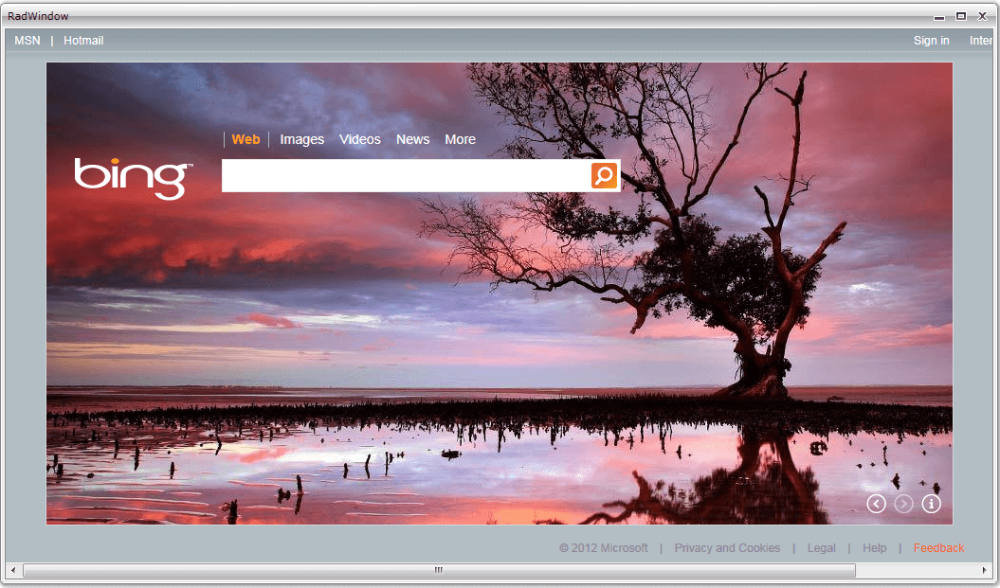

# Overview

## 

Thank you for choosing Telerik __RadHtmlPlaceholder__!
				

__RadHtmlPlaceHolder__ is a powerful tool to show external web pages inside your Silverlight application, thus significantly increasing the overall user experience.
				

## See Also[Getting Started with RadHtmlPlaceholder - Video Tutorial ](http://tv.telerik.com/watch/silverlight/video/introduction-radhtmlplaceholder-silverlight)

 * [RadHtmlPlaceholder Events]()

 * [Display HTML string in RadHtmlPlaceholder]()

 * [Display external page in RadHtmlPlaceholder]()

 * [Integrating RadHtmlPlaceholder and RadWindow]()

 * [Getting Started]()
