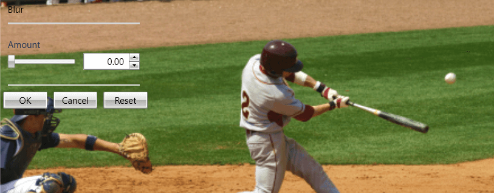
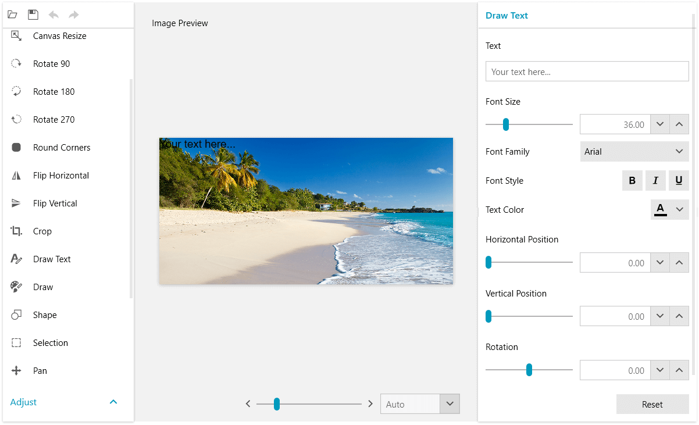

# Tools

__RadImageEditor__ provides a set of tools that allows you to customize the image element.

The tools are activating UI which enables live preview of the operations executed by the image editor [commands](). When you adjust the image preview, the tool can be committed which will execute the corresponding command and register the action in the [history stack]().

The following list shows the available [ITool](https://docs.telerik.com/devtools/wpf/api/telerik.windows.media.imaging.tools.itool) implementations.

* __BlurTool__: Uses 2 pixel shaders.

* __CanvasResizeTool__

* __ContrastTool__

* __CropTool__

* __DrawTextTool__

* [DrawTool]()

* __HueShiftTool__

* [PanTool]() (not registered in the history stack)

* __ResizeTool__

* __RoundCornersTool__

* __SaturationTool__

* __SharpenTool__

* [ShapeTool]()

The effects in __RadImageEditor__ that are implemented using pixel shaders enable the use of hardware acceleration whenever the platform supports it. This result in most effects being applied almost instantly, enabling real-time preview with sliders for the parameter values. You can easily create a command using your own custom shader by implementing __EffectCommandBase__. This approach is shown in [this blog post](http://blogs.telerik.com/blogs/posts/11-07-20/under-the-hood-of-radimageeditor-for-silverlight-and-wpf.aspx) with a sample implementation of a blur command.
        
>tip See the different tool setting UIs in the __ImageEditor__ [demo](https://demos.telerik.com/wpf/) of RadImageEditorUI.

## Excecuting Tools

To execute a tool and display its UI, call the `ExecuteCommand` method of RadImageEditor with an instance of the corresponding tool as parameter. A tool can be excecuted also by using the [ExecuteTool command]().

__Example 1: Executing a tool in code__
```C#
	this.radImageEditor.ExecuteTool(new BlurTool());
```

__Example 2: Executing a tool using the ExecuteTool command__
```XAML
	 <Grid>
        <telerik:RadImageEditor x:Name="radImageEditor" />
        <telerik:RadButton Content="Blur Tool"  
                           Command="commands:ImageEditorRoutedCommands.ExecuteTool"
                           CommandTarget="{Binding ElementName=radImageEditor}">
            <telerik:RadButton.CommandParameter>
                <tools:BlurTool />
            </telerik:RadButton.CommandParameter>
        </telerik:RadButton>
    </Grid>
```

All tools are located in the Telerik.Windows.Media.Imaging.Tools namespace and can be created in XAML. `xmlns:tools="clr-namespace:Telerik.Windows.Media.Imaging.Tools;assembly=Telerik.Windows.Controls.ImageEditor"`

The __commands__ namespace declaration points to the following namespace: `xmlns:commands="clr-namespace:Telerik.Windows.Media.Imaging.ImageEditorCommands.RoutedCommands;assembly=Telerik.Windows.Controls.ImageEditor"`

The tool settings UI is displayed over the image in a special container - `InlineToolSettings` element. The container is positioned over the RadImageEditor at its top left corner.

#### Figure 1: Blur inline settings UI


When using [RadImageEditorUI]() the settings UI is displayed aligned at the right side of the control.

#### Figure 2: Blur settings UI in RadImageEditorUI


## See Also  
* [Commands]()
* [Create a Custom Tool]()