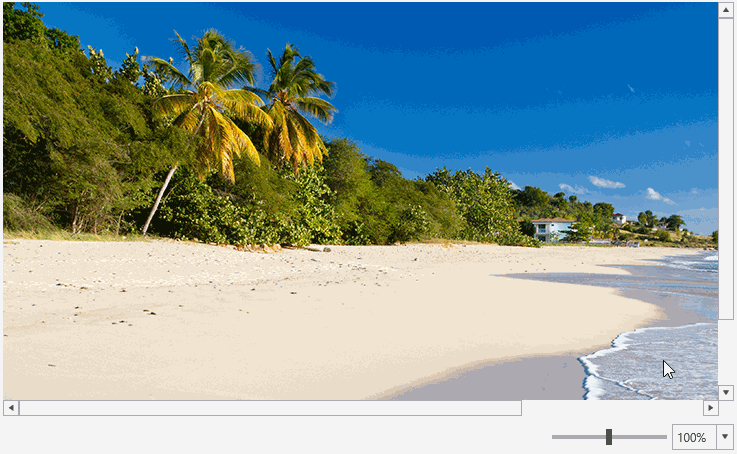
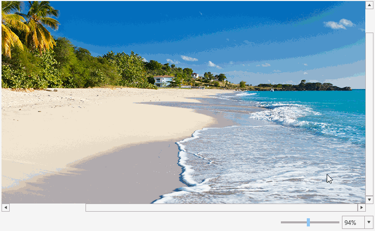
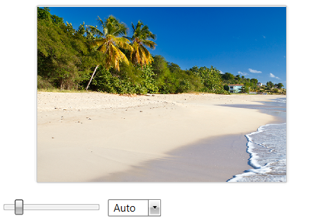

# Zooming

RadImageEditor provides out of the box zooming functionality. 

You can zoom in the opened image by holding **Ctrl** and spinning the **mouse wheel** or by using the slider and dropdown of the **ZoomController** provided by the [RadImageEditorUI]().

#### Figure 1: Default zoom capabilities 


## Disabling the MouseWheel Zooming

In order to disable the zooming with the mouse wheel, you can set the __AllowMouseWheelScaling__ property to __False__ as demonstrated in __Example 1__. 

__Example 1: Setting the AllowMouseWheelScaling property__
```XAML
	<telerik:RadImageEditor AllowMouseWheelScaling="False" />
```

## Zoom to Mouse Cursor

As can be seen in **Figure 1**, the default zooming mechanism does not take into account the position of the mouse cursor.

As of version **2018.2.716**, both RadImageEditor and RadImageEditorUI controls expose a **ZoomToCursor** property. By setting this property to **True**, holding **Ctrl** and spinning the **mouse wheel** will zoom towards the position of the mouse cursor. The result can be observed in **Figure 2**.

#### Figure 2: Zooming to the mouse cursor  


## Zooming Programmatically

The RadImageEditor API allows you to zoom programmatically via the __ScaleFactor__ property. 

The minimum allowed scale factor is 0, which is the default value. Setting ScaleFactor to 0 __autoscales__ the image. You can also do this by calling the RadImageEditor's __AutoScaleImage__ method.

The __value of 1__ means that the image is not zoomed-in and its original size is used. A value __less than 1__, zooms-out the image. A value __greater than 1__, zooms-in the image.

__Example 2: Setting ScaleFactor to zoom-in the image__
```XAML
	<telerik:RadImageEditor ScaleFactor="1.5" />
```

To get the actual scale factor, when the picture is autoscaled, check the __ActualScaleFactor__ property.

To listen for changes in the zoom level, use the __ScaleFactorChanged__ event of RadImageEditor.

__Example 3: Subscribing to the ScaleFactorChanged event__
```XAML
	<telerik:RadImageEditor ScaleFactorChanged="RadImageEditor_ScaleFactorChanged" />
```

__Example 4: Defining ScaleFactorChanged event handler__
```C#
	private void RadImageEditor_ScaleFactorChanged(object sender, EventArgs e)
	{
	}
```

## Using the Zoom Controller

The [RadImageEditorUI]() control has a built-in zoom controller (a slider) element that allows you to zoom in and out. The slider is shown in __Figure 1__.

To use the control separately with __RadImageEditor__, you can define the __ZoomController__ element, and set its __ImageEditor__ control.

__Example 5: Using ZoomController__
```XAML
	<Grid>
        <Grid.RowDefinitions>
            <RowDefinition />
            <RowDefinition Height="Auto" />
        </Grid.RowDefinitions>
        <telerik:RadImageEditor x:Name="ImageEditor"/>        
        <imageEditor:ZoomController ImageEditor="{Binding ElementName=ImageEditor}" Grid.Row="1" />
        <!-- imageEditor points to xmlns:imageEditor="clr-namespace:Telerik.Windows.Media.Imaging;assembly=Telerik.Windows.Controls.ImageEditor" -->
    </Grid>
```

#### Figure 3: ZoomController


## See Also  
 * [History]()
 * [Panning]()