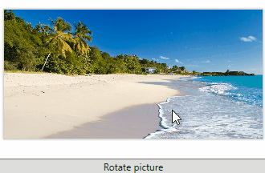

# Getting Started with {{ site.framework_name }} ImageEditor

This tutorial will walk you through the creation of a sample application that contains __RadImageEditor__. 

## Adding Telerik Assemblies Using NuGet

To use __RadImageEditor__ when working with NuGet packages, install the `Telerik.Windows.Controls.ImageEditor.for.Wpf.Xaml` package. The [package name may vary]() slightly based on the Telerik dlls set - [Xaml or NoXaml]()

Read more about NuGet installation in the [Installing UI for WPF from NuGet Package]() article.

>tip With the 2025 Q1 release, the Telerik UI for WPF has a new licensing mechanism. You can learn more about it [here]().

## Adding Assembly References Manually

If you are not using NuGet packages, you can add a reference to the following assemblies:

* __Telerik.Licensing.Runtime__
* __Telerik.Windows.Controls__
* __Telerik.Windows.Controls.ImageEditor__
* __Telerik.Windows.Controls.Input__

## Adding RadImageEditor to the Project

The next few code examples will demonstrate how to add a __RadImageEditor__ in XAML, load a sample picture and execute a command on that picture. __Example 1__ showcases a __RadImageEditor__ and a Button defined in XAML.

__Example 1: Defining a RadImageEditor in xaml__

<snippet id='radimageeditor-getting-started-example_1_defining_a_radimageeditor_in_xaml-xaml' />

__Example 2__ shows the telerik namespace used in __Example 1__:

__Example 2: Telerik Namespace declaration__
<snippet id='radimageeditor-getting-started-example_2_telerik_namespace_declaration-xaml' />

In order to show a picture, you can set the __Image__ property of the __RadImageEditor__. It is of type [RadBitmap](https://docs.telerik.com/devtools/wpf/api/telerik.windows.media.imaging.radbitmap). __Example 3__ demonstrates how you can use the [ImageExampleHelper](https://github.com/telerik/xaml-sdk/blob/master/ImageEditor/RadImageEditorUIFirstLook/ImageExampleHelper.cs) class in order to load an Image. It assumes that there is a folder named "SampleImages" with an image named "RadImageEditor.png" inside the project. 

__Example 3: Load image in RadImageEditor__

<snippet id='radimageeditor-getting-started-example_3_load_image_in_radimageeditor-cs' />

<snippet id='radimageeditor-getting-started-example_3_load_image_in_radimageeditor-vb' />

__Example 4: ImageExampleHelper used in Example 3__

<snippet id='radimageeditor-getting-started-example_4_imageexamplehelper_used_in_example_3-cs' />

<snippet id='radimageeditor-getting-started-example_4_imageexamplehelper_used_in_example_3-vb' />

#### __Figure 1: Result from the above examples__

## Commands and Tools

__Example 3__ demonstrates the usage of a single command over the loaded image. However, the __RadImageEditor__ provides many more [Commands and Tools](), which can be executed both in code-behind or XAML. 

## RadImageEditorUI

__RadImageEditor__ is easy to integrate with all kinds of UI thanks to the commanding mechanism that it employs. It has a good-to-go UI that comes out of the box. That is [__RadImageEditorUI__](), which is quite easily wired to work with the commands and tools that __RadImageEditor__ exposes. As both controls follow closely the command pattern, they can be set up to work with little to no code-behind. However, you can implement and wire custom UI, too.

## Setting a Theme

The controls from our suite support different themes. You can see how to apply a theme different than the default one in the [Setting a Theme]() help article.

>important Changing the theme using implicit styles will affect all controls that have styles defined in the merged resource dictionaries. This is applicable only for the controls in the scope in which the resources are merged. 

To change the theme, you can follow the steps below:

* Choose between the themes and add reference to the corresponding theme assembly (ex: **Telerik.Windows.Themes.Windows8.dll**). You can see the different themes applied in the **Theming** examples from our [WPF Controls Examples](https://demos.telerik.com/wpf/) application.

* Merge the ResourceDictionaries with the namespace required for the controls that you are using from the theme assembly. For the __RadImageEditor__, you will need to merge the following resources:

	* __Telerik.Windows.Controls__
	* __Telerik.Windows.Controls.Input__
	* __Telerik.Windows.Controls.ImageEditor__

__Example 4__ demonstrates how to merge the ResourceDictionaries so that they are applied globally for the entire application.

__Example 4: Merge the ResourceDictionaries__  
<snippet id='radimageeditor-getting-started-example_4_merge_the_resourcedictionaries-xaml' />

>Alternatively, you can use the theme of the control via the [StyleManager](https://docs.telerik.com/devtools/wpf/styling-and-appearance/stylemanager/common-styling-apperance-setting-theme-wpf)[StyleManager](https://docs.telerik.com/devtools/silverlight/styling-and-appearance/stylemanager/common-styling-apperance-setting-theme).

__Figure 2__ shows a __RadImageEditor__ with the **Windows8** theme applied.

#### __Figure 2: RadImageEditor with the Windows8 theme__


## Telerik UI for WPF Learning Resources

* [Telerik UI for WPF ImageEditor Component](https://www.telerik.com/products/wpf/imageeditor.aspx)
* [Getting Started with Telerik UI for WPF Components]()
* [Telerik UI for WPF Installation]()
* [Telerik UI for WPF and WinForms Integration]()
* [Telerik UI for WPF Visual Studio Templates]()
* [Setting a Theme with Telerik UI for WPF]()
* [Telerik UI for WPF Virtual Classroom (Training Courses for Registered Users)](https://learn.telerik.com/learn/course/external/view/elearning/16/telerik-ui-for-wpf) 
* [Telerik UI for WPF License Agreement](https://www.telerik.com/purchase/license-agreement/wpf-dlw-s)


## See Also

* [RadImageEditorUI]()
* [Import and Export]()

