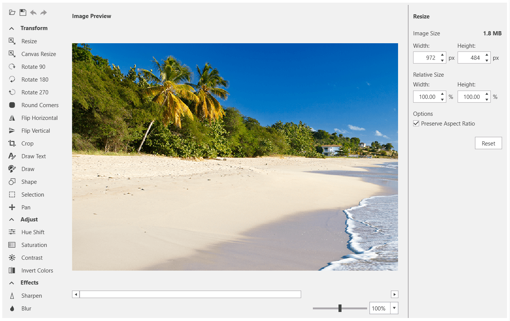

# {{ site.framework_name }} ImageEditor Overview

__RadImageEditor__ is a control that can be used to preview and edit images in different file formats. It is meant to be used as a stand-alone control, but has also been integrated in __RadRichTextBox__.  



       

## Key Features

* __Rich image editing features set__: The control comes with a bunch of tools that applies different effects to the loaded image. For example, __crop, canvas resize, hue shift, saturation, contrast, rotations, adding text, drawing__, etc. Read more about this in the [Commands and Tools]() article.

* __Support for various image formats__: The control allows you to import and export different image formats. The following formats could be imported - __JPEG, PNG, TIFF, GIF, ICO__. The following formats can be exported - __PNG, BMP, JPEG, TIFF, GIF__. Read more about this in the [Import/Export]() article.

* __Custom tools__: __RadImageEditor__ is highly extensible, so you can implement and utilize additional image editing tools, as well as import and export in other formats. Read more about this in the [How to]() section of the documentation.

* __History__: The control keeps an undo/redo stack with the changes applied to the image. This means that you can reverse and re-apply actions. Read more about this in the [History]() article.

* __RadImageEditorUI__: An additional control that wraps the RadImageEditor and enriches it with a UI that allows you to easily edit the image without manually executing the different tools. Read more about this in the [RadImageEditorUI]() article.

>tip Get started with the control with its [Getting Started]() help article that shows how to use it in a basic scenario.

> Check out the online demo at [demos.telerik.com](https://demos.telerik.com/silverlight/#ImageEditor/FirstLook)[demos.telerik.com](https://demos.telerik.com/wpf/)


## Telerik UI for WPF Support and Learning Resources

* [Telerik UI for WPF ImageEditor Homepage](https://www.telerik.com/products/wpf/imageeditor.aspx)
* [Get Started with the Telerik UI for WPF ImageEditor]()
* [Telerik UI for WPF API Reference](https://docs.telerik.com/devtools/wpf/api/)
* [Getting Started with Telerik UI for WPF Components]()
* [Telerik UI for WPF Virtual Classroom (Training Courses for Registered Users)](https://learn.telerik.com/learn/course/external/view/elearning/16/telerik-ui-for-wpf) 
* [Telerik UI for WPF ImageEditor Forums](https://www.telerik.com/forums/wpf)
* [Telerik UI for WPF Knowledge Base](https://docs.telerik.com/devtools/wpf/knowledge-base)


## See Also   
 * [Zooming]()
 * [Panning]()
 * [Developer Focused Examples]()
