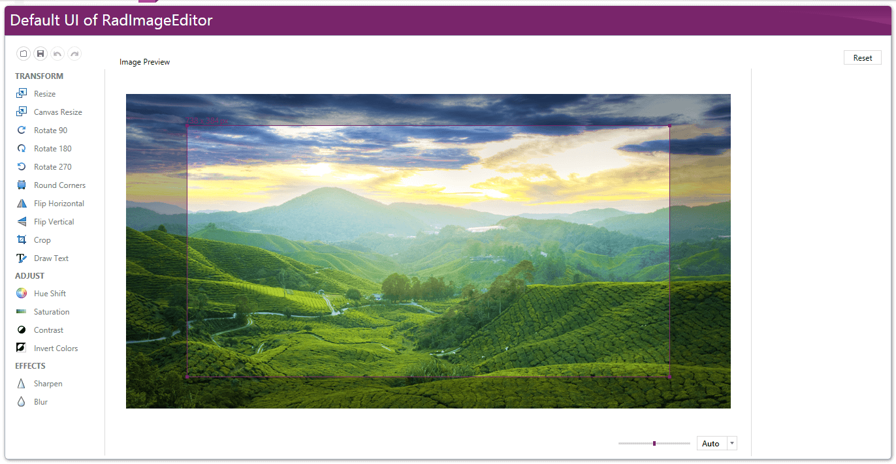

# Cropping

The __CropTool__ is one of the tools that come out-of-the-box with __RadImageEditor__ and gives the opportunity to crop a given area from an image. The tool provides some customization options that are explained in detail in this topic.

When the tool is invoked, a crop adorner rectangle is shown over the image. It visualizes the part of the image that is going to be cropped when the tool is invoked.
      
#### __Figure 1: Crop Adorner__
     

## Using the CropTool

In __Figure 1__ the CropTool is added to the RadImageEditorUI by defining an __ImageToolItem__ and with its CommandParameter set to a new CropTool as demonstrated in __Example 1__.

__Example 1: Adding a CropTool__

```XAML
	<telerik:RadImageEditorUI x:Name="ImageEditorUI"
							  xmlns:tools="clr-namespace:Telerik.Windows.Media.Imaging.Tools;assembly=Telerik.Windows.Controls.ImageEditor"
							  xmlns:commands="clr-namespace:Telerik.Windows.Media.Imaging.ImageEditorCommands.RoutedCommands;assembly=Telerik.Windows.Controls.ImageEditor">
		<telerik:RadImageEditorUI.ImageToolsSections>
			<telerik:ImageToolsSection Header="TRANSFORM">
				<telerik:ImageToolItem ImageKey="Crop" telerik:LocalizationManager.ResourceKey="ImageEditor_Crop" Command="commands:ImageEditorRoutedCommands.ExecuteTool">
					<telerik:ImageToolItem.CommandParameter>
						<tools:CropTool />
					</telerik:ImageToolItem.CommandParameter>
				</telerik:ImageToolItem>
			</telerik:ImageToolsSection>
		</telerik:RadImageEditorUI.ImageToolsSections>
	</telerik:RadImageEditorUI>
```

> The rest of the examples in this article assume that the RadImageEditorUI is set up as demonstrated in __Example 1__.

Alternatively, you can also use __ExecuteTool__ method of the RadImageEditor in order to execute a CropTool.

__Example 2: Executing a CropTool__

```C#
	this.ImageEditorUI.ImageEditor.ExecuteTool(new CropTool());
```
```VB.NET
	Me.ImageEditorUI.ImageEditor.ExecuteTool(New CropTool())
```

## InitialSize

The __InitialSize__ property of the CropTool is of type Size and determines the initial size of the crop adorner. Unless explicitly set, the rectangle has width and height equal to 80% of the width and height of the image that is shown in the control.

__Example 3__ demonstrates how to set the initial size of the tool in XAML and in code.

__Example 3: Set initial size in XAML__

```XAML
	<tools:CropTool InitialSize="150,150" />
```

__Example 4: Set initial size in code-behind__

```C#
	CropTool cropTool = new CropTool();
	cropTool.InitialSize = new Size(150, 150);
	this.ImageEditorUI.ImageEditor.ExecuteTool(cropTool);
```
```VB.NET
	Dim cropTool As New CropTool()
	cropTool.InitialSize = New Size(150, 150)
	Me.ImageEditorUI.ImageEditor.ExecuteTool(cropTool)
```

## FixedSize

The __FixedSize__ property is of type Size and specifies the only size that is allowed for the Crop tool. This means that the crop adorner is shown with those dimensions and resizing it is not possible.
        
__Example 3__ shows how to set fixed size in XAML and in code.

__Example 5: Set fixed size in XAML__

```XAML
	<tools:CropTool FixedSize="200,100" />
```

__Example 6: Set fixed size in code-behind__

```C#
	CropTool cropTool = new CropTool();
	cropTool.FixedSize = new Size(200, 100);
	this.ImageEditorUI.ImageEditor.ExecuteTool(cropTool);
```
```VB.NET
	Dim cropTool As New CropTool()
	cropTool.FixedSize = New Size(200, 100)
	Me.ImageEditorUI.ImageEditor.ExecuteTool(cropTool)
```

>If the image shown in RadImageEditor has smaller dimensions than the ones set for the tool's initial or fixed size, the crop adorner gets limited to the boundaries of the image. For example, if the image's size is (200,300) and you set fixed size to the crop tool (300,50), the crop rectangle will be shown with size (200,50).
          
## AspectRatio

The __AspectRatio__ property of the crop tool determines whether the width and height of the crop adorner are in linear dependence. The value can be a positive decimal number and specifying it "locks" the ratio between the width and height of the crop rectangle.        

The calculated ratio value corresponds to the width of the adorner divided by its height. This means that if you want a crop rectangle that has a width 2 times smaller than its height, you should set value 0.5 to the AspectRatio. __Example 3__ shows how this can be done in XAML and in code behind.
        
__Example 7: Set fixed aspect ratio in XAML__

```XAML
	<tools:CropTool AspectRatio="0.5"/>
```

__Example 8: Set fixed aspect ratio in code-behind__

```C#
	CropTool cropTool = new CropTool();
	cropTool.AspectRatio = 0.5;
	this.ImageEditorUI.ImageEditor.ExecuteTool(cropTool);
```
```VB.NET
	Dim cropTool As New CropTool()
	cropTool.AspectRatio = 0.5
	Me.ImageEditorUI.ImageEditor.ExecuteTool(cropTool)
```

>tipYou can crop an image with fixed ratio between the width and height without setting the FixedRatio property. Just press and hold the __Shift__ key while dragging the crop adorner.
          
## See Also

* [Commands and Tools]()
* [Drawing]()
* [Shape Tool]()
