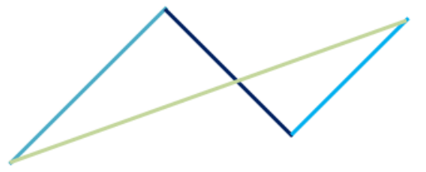
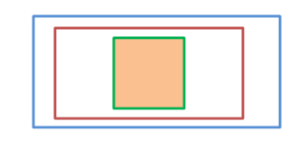
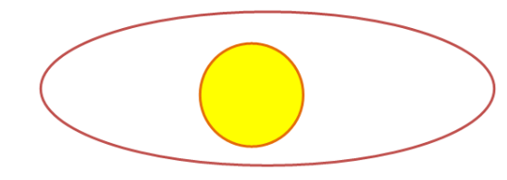

# Shape Tool

The Shape Tool is one of the tools, which come out-of-the-box with the __RadImageEditor__ and allow you to draw different shapes over an image.

The tool could be added to the UI of __RadImageEditor__ as shown in __Example 1__.

__Example 1: Add Shape Tool__
```XAML
	<telerik:ImageToolItem ImageKey="Shape" telerik:LocalizationManager.ResourceKey="ImageEditor_Shape" Command="commands:ImageEditorRoutedCommands.ExecuteTool">
	    <telerik:ImageToolItem.CommandParameter>
	        <tools:ShapeTool>
	            <tools:ShapeTool.Shapes>
	                <shapes:RectangleShape />
	            </tools:ShapeTool.Shapes>
	        </tools:ShapeTool>
	    </telerik:ImageToolItem.CommandParameter>
	</telerik:ImageToolItem>
``` 

The namespaces that should be registered are as follows:

__Example 2: Register namespaces__
```XAML
	xmlns:telerik="http://schemas.telerik.com/2008/xaml/presentation"
	xmlns:tools="clr-namespace:Telerik.Windows.Media.Imaging.Tools;assembly=Telerik.Windows.Controls.ImageEditor"  
	xmlns:shapes="clr-namespace:Telerik.Windows.Media.Imaging.Shapes;assembly=Telerik.Windows.Controls.ImageEditor"
	xmlns:commands="clr-namespace:Telerik.Windows.Media.Imaging.ImageEditorCommands.RoutedCommands;assembly=Telerik.Windows.Controls.ImageEditor"
```

By default, the __ShapeTool__ provides three predefined shapes:

* __Line__: Allows to draw lines only with dragging.



* __Rectangle__: Draws rectangles or squares (when the __LockRatio__ property is set to true)

 

* __Ellipse__: Allows you to create ellipses or circles (when the __LockRatio__ property is set to true)



The __Shape Tool__ provides an options to easily customize your shape – you can choose if the shape will be filled with some color or it will consist only of borders, which color and thickness also depends on your preferences. You could take advantage of the __LockRatio__ property, which will ensure that the proportions of the shape will be always the same when resizing.


## How to Create a Custom Shape

You could customize the shapes in the __ShapeTool__ to fit specific requirements. To create a custom shape, the simple __IShape__ interface should be implemented. 


__Example 3: Inherit the IShape interface__
```C#
	public class TelerikLogo : IShape
```

__Example 3: Inherit the IShape interface__
```VB
	Public Class TelerikLogo
	    Implements IShape
	    '...
```

It exposes two members:

* __string DisplayName__: Тhe name, which will be displayed in the dropdown list.
* __Geometry GetShapeGeometry__: Тhe exact figure.

Example 4 shows a sample implementation of a custom shape.

__Example 4: Implement custom shape__
```C#
	public string DisplayName
	{
	    get
	    {
	        return "Telerik";
	    }
	}

	public Geometry GetShapeGeometry()
	{
	    PathFigure outer = new PathFigure();
	    outer.IsClosed = true;
	    outer.StartPoint = new Point(0, 2.5);
	    outer.Segments.Add(new LineSegment() { Point = new Point(2.5, 0) });
	    outer.Segments.Add(new LineSegment() { Point = new Point(5, 2.5) });
	    outer.Segments.Add(new LineSegment() { Point = new Point(7.5, 0) });
	    outer.Segments.Add(new LineSegment() { Point = new Point(10, 2.5) });
	    outer.Segments.Add(new LineSegment() { Point = new Point(9, 3.5) });
	    outer.Segments.Add(new LineSegment() { Point = new Point(7.5, 2) });
	    outer.Segments.Add(new LineSegment() { Point = new Point(6, 3.5) });
	    outer.Segments.Add(new LineSegment() { Point = new Point(8.5, 6) });
	    outer.Segments.Add(new LineSegment() { Point = new Point(5, 9.5) });
	    outer.Segments.Add(new LineSegment() { Point = new Point(1.5, 6) });
	    outer.Segments.Add(new LineSegment() { Point = new Point(4, 3.5) });
	    outer.Segments.Add(new LineSegment() { Point = new Point(2.5, 2) });
	    outer.Segments.Add(new LineSegment() { Point = new Point(1, 3.5) });

	    PathFigure inner = new PathFigure();
	    inner.StartPoint = new Point(3.5, 6);
	    inner.IsClosed = true;
	    inner.Segments.Add(new LineSegment() { Point = new Point(5, 7.5) });
	    inner.Segments.Add(new LineSegment() { Point = new Point(6.5, 6) });
	    inner.Segments.Add(new LineSegment() { Point = new Point(5, 4.5) });

	    PathGeometry logoGeometry = new PathGeometry();
	    logoGeometry.Figures.Add(inner);
	    logoGeometry.Figures.Add(outer);

	    return logoGeometry;
	}
```


__Example 4: Implement custom shape__
```VB

	Public ReadOnly Property DisplayName() As String Implements IShape.DisplayName
	    Get
	        Return "Telerik"
	    End Get
	End Property

	Public Function GetShapeGeometry() As Geometry Implements IShape.GetShapeGeometry
	    Dim outer As New PathFigure()
	    outer.IsClosed = True
	    outer.StartPoint = New Point(0, 2.5)
	    outer.Segments.Add(New LineSegment() With {.Point = New Point(2.5, 0)})
	    outer.Segments.Add(New LineSegment() With {.Point = New Point(5, 2.5)})
	    outer.Segments.Add(New LineSegment() With {.Point = New Point(7.5, 0)})
	    outer.Segments.Add(New LineSegment() With {.Point = New Point(10, 2.5)})
	    outer.Segments.Add(New LineSegment() With {.Point = New Point(9, 3.5)})
	    outer.Segments.Add(New LineSegment() With {.Point = New Point(7.5, 2)})
	    outer.Segments.Add(New LineSegment() With {.Point = New Point(6, 3.5)})
	    outer.Segments.Add(New LineSegment() With {.Point = New Point(8.5, 6)})
	    outer.Segments.Add(New LineSegment() With {.Point = New Point(5, 9.5)})
	    outer.Segments.Add(New LineSegment() With {.Point = New Point(1.5, 6)})
	    outer.Segments.Add(New LineSegment() With {.Point = New Point(4, 3.5)})
	    outer.Segments.Add(New LineSegment() With {.Point = New Point(2.5, 2)})
	    outer.Segments.Add(New LineSegment() With {.Point = New Point(1, 3.5)})

	    Dim inner As New PathFigure()
	    inner.StartPoint = New Point(3.5, 6)
	    inner.IsClosed = True
	    inner.Segments.Add(New LineSegment() With {.Point = New Point(5, 7.5)})
	    inner.Segments.Add(New LineSegment() With {.Point = New Point(6.5, 6)})
	    inner.Segments.Add(New LineSegment() With {.Point = New Point(5, 4.5)})

	    Dim logoGeometry As New PathGeometry()
	    logoGeometry.Figures.Add(inner)
	    logoGeometry.Figures.Add(outer)

	    Return logoGeometry
	End Function
```

>tip You could download runnable project with Custom Shape from our [SDK repository](https://github.com/telerik/xaml-sdk/tree/master/ImageEditor/Drawing)


## Add Custom Shape 

After creating a custom shape, it should be registered in the tool. This could be achieved declaratively as well as in the code behind as shown in __Examples 5 and 6__. You could get or set the shapes in the __ShapeTool__ trough the __Shapes__ collection. 

__Example 5: Add custom shape to the shape tool__
```C#
	ShapeTool tool = new ShapeTool();
	tool.Shapes.Add(new RectangleShape());
	tool.Shapes.Add(new EllipseShape());
	tool.Shapes.Add(new LineShape());
	tool.Shapes.Add(new TelerikLogo());
```

__Example 5: Add custom shape to the shape tool__
```VB
	Dim tool As New ShapeTool()
	tool.Shapes.Add(New RectangleShape())
	tool.Shapes.Add(New EllipseShape())
	tool.Shapes.Add(New LineShape())
	tool.Shapes.Add(New TelerikLogo())

```

__Example 5: Add custom shape to the shape tool__
```XAML
	<tools:ShapeTool>
	    <tools:ShapeTool.Shapes>
	        <shapes:RectangleShape />
	        <shapes:EllipseShape />
	        <shapes:LineShape />
	        <local:TelerikLogo />
	    </tools:ShapeTool.Shapes>
	</tools:ShapeTool>
```

## See also

* [Draw Tool]()
* [Crop Tool]()